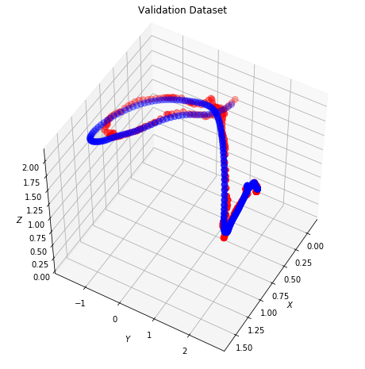

Localization is an essential task for robotics applications. To know the exact pose (position and orientation) of the agent it's essential for visualization, navigation, prediction, and planning.

In this project I will cover the pipeline used in our paper to localize the pose of the drone using only streams of camera images and IMU data.
I use Python and Pytorch for this project.

To reproduce the results, please, download EuRoC Mav dataset at https://projects.asl.ethz.ch/datasets/doku.php?id=kmavvisualinertialdatasets#downloads.


# A Pytorch Implementation of Our Work 


```python
from __future__ import print_function, division

import os
import sys
import time
import glob
import random
import numpy as np
import pandas as pd

from skimage import io, transform
from PIL import Image
from tqdm import tqdm
from datetime import datetime
import argparse
from bisect import bisect_right, bisect_left

import shutil
import torch
import torchvision
import torch.nn.functional as F
import torch.nn as nn
from torchvision import transforms, utils
import torchvision.transforms as transforms
from torchvision.transforms import transforms
from torch.utils.data import DataLoader
from torch.utils.data.dataset import Dataset
from torchvision import transforms
from torch.utils.data.sampler import SubsetRandomSampler
import torchvision.models as models
import torch.optim as optim

# Ignore warnings
import warnings
warnings.filterwarnings("ignore")

%matplotlib inline

plt.ion()   # interactive mode
```

# Import data

```python
def return_idx(timestamps, data):
    "Return the idx of the timestamp of the camera"
    idx_sensor = []
    for temp in timestamps:
        idx=int(data[data['timestamp']==temp].index[0])
        idx_sensor.append(idx)
    return idx_sensor


def return_idx_single(temp, data):
    "Return the idx of the timestamp of the camera"
    idx_sensor = []
    idx = data[data['timestamp']==temp].index[0]
    return idx
```

#### Import csv data from folders

```python
imu_data = pd.read_csv('/home/francesca/euroc12/imu0/')
camera_data = pd.read_csv('home/francesca/euroc12/cam0/')
vicon_data = pd.read_csv('/home/francesca/euroc12/vicon0/')
#drop the first row of the camera
camera_data=camera_data.drop(cmera_data.index[[0]])

# re-assign name to columns
vicon_data.columns = ['timestam','px','py','pz','qw','qx','qy','qz']
camera_data.columns = ['timestamp','filename']
imu_data.columns =['timestamp','wx','wy','wz','ax','ay','az']

# Get the timestamp of the camera and drop the index
camera_timestamps = camera_data['timestamp']
camera_timestamps = camera_timestamps.reset_index(drop=True)

# Interpolate Vicon data to get data at the same timestamp of the camera and IMU

vicondata = vicon_data.copy() #create a copy

for i in range(len(camera_timestamps)):
    new_row=pd.DataFrame([[camera_timestamps[i],np.nan,np.nan,np.nan,np.nan,np.nan,np.nan,np.nan]], columns = ['timestamp','px','py','pz','qw','qx','qy','qz'])
    vicondata = pd.concat([vicondata, pd.DataFrame(new_row)], ignore_index=True)
    
vicondata.sort_values(by=['timestamp'],inplace=True, ascending=True)
vicondata = vicondata.reset_index(drop = True)
vicondata = vicondata.interpolate()

# Create a new vicon dataframe with the same timestamps of the camera
idx_vicon=return_idx(camera_timestamps,vicondata)
new_vicon = vicondata.ix[idx_vicon].reset_index(drop=True)

vicon_timestamp = new_vicon['timestamp'].values

# Create a new vicon dataframe with the same timestamps of the camera
idx_vicon=return_idx(camera_timestamps,vicondata)
new_vicon = vicondata.ix[idx_vicon].reset_index(drop=True)

vicon_timestamp = new_vicon['timestamp'].values

# Create a new IMU dataframe with the same timestamps of the camera
idx_imu = return_idx(camera_timestamps, imu_data)
new_imu = imu_data.ix[idx_imu].reset_index(drop=True)
imu_timestamp = new_imu['timestamp'].values

# Create new dataframe for images and save it
image_data = pd.merge(camera_data,new_vicon, on='timestamp').reset_index(drop=True)
image_data.to_csv('euroc12/cam0/image_data.csv',index = None, header=True)

file = pd.read_csv('euroc12/cam0/image_data.csv')
file.drop(file.tail(13).index,inplace=True) # drop last n rows
file.to_csv('euroc12/cam0/file.csv',index = None, header=True)


img_name = file.iloc[:, 1]
labels = file.iloc[:, 2:].as_matrix()

c_t = np.array(camera_timestamps)
new_imu_values = np.zeros((len(c_t),10,7))

# Create a new IMU dataframe with the same timestamps of the camera
for i in range(len(c_t)):
    idx_imu = return_idx_single(camera_timestamps.iloc[i], imu_data)
    new_imu_values[i][:][:] = imu_data.ix[idx_imu:idx_imu+9].reset_index(drop=True).values


new_imu_values = new_imu_values[:1696]

# Create new dataframe for images and save it

image_data = pd.merge(camera_data,new_vicon, on='timestamp').reset_index(drop=True)
image_data.to_csv(r'/home/francesca/euroc12/cam0/imag_data.csv',index = None, header=True)
```
# Crreate a new dataset


```python
class NewDataset(Dataset):
    def __init__(self, csv_file, imu_data, root_dir):       
        """
        Args:
            csv_file (string): Path to the csv file with annotations.
            root_dir (string): Directory with all the images.
            transform (callable, optional): Optional transform to be applied
                on a sample.
        """
        self.frame = pd.read_csv(csv_file)
        self.imu_data = imu_data
        # Second - 7th columns contains the angular rate and acceleration
        self.imu_arr = self.imu_data[:,:,1:]

        # Second column contains the image name
        self.image_arr = np.asarray(self.frame.iloc[:, 1])
        self.label_arr = np.asarray(self.frame.iloc[:, 2:])
        self.root_dir = root_dir
        # Transforms
        transformation = transforms.Compose([
            transforms.Resize(64),
            transforms.CenterCrop((64,96)),
            transforms.ToTensor(),
            transforms.Normalize([0.4543, 0.4543, 0.4543],[0.3035, 0.3035, 0.3035])
        ])
        self.transform = transformation
        # Calculate len
        self.data_len = len(self.frame.index)
        transform_imu = transforms.Compose([
            transforms.ToTensor(),
        ])
        self.transform_imu = transform_imu
    def __len__(self):
        return self.data_len
    
    def __getitem__(self, idx):
        single_image_name = self.image_arr[idx]
        fp = self.root_dir
        # Open image
        image = Image.open(fp + single_image_name).convert('RGB')
        image = self.transform(image)
        imu_data = self.imu_arr[idx]
        # Get label of the image based on the cropped pandas column
        labels = self.label_arr[idx]

        return image, imu_data, labels
```


```python
dataset = NewDataset(csv_file='euroc12/cam0/file.csv', 
                         imu_data=new_imu_values,
                           root_dir='euroc12/cam0/data/')

dataloader = DataLoader(dataset, batch_size=32,
                        shuffle=False, num_workers=15)
```

# Let's train

```python
batch_size = 32
validation_split = .2
shuffle_dataset = True
random_seed= 42

# Creating data indices for training and validation splits:
dataset_size = len(dataset)
indices = list(range(dataset_size))
split = int(np.floor(validation_split * dataset_size))
# split = 320
if shuffle_dataset :
    np.random.seed(random_seed)
    np.random.shuffle(indices)
train_indices, val_indices = indices[split:], indices[:split]

# Creating PT data samplers and loaders:
train_sampler = SubsetRandomSampler(train_indices)
valid_sampler = SubsetRandomSampler(val_indices)

train_loader = torch.utils.data.DataLoader(dataset, batch_size=batch_size, 
                                           sampler=train_sampler)
validation_loader_1 = torch.utils.data.DataLoader(dataset, batch_size=batch_size,
                                                sampler=valid_sampler)
```


```python
def quaternion_angular_error(q1, q2):
    """
    angular error between two quaternions
    :param q1: (4, )
    :param q2: (4, )
    :return:
    """
    d = abs(np.dot(q1, q2))
    abs_q1 = np.linalg.norm(q1)
    abs_q2 = np.linalg.norm(q2)
    d = d / (abs_q1 * abs_q2)
    d = min(1.0, max(-1.0, d))
    theta = 2 * np.arccos(d) * 180 / np.pi
    return theta
```
## The Network Model

```python
class Flatten(nn.Module):
    def forward(self, input):
        return input.view(input.size(0), -1)

class UnFlatten(nn.Module):
    def forward(self, input):
        return input.view(input.size(0), -1, 1, 1)


class FlattenIMU(nn.Module):
    def forward(self, input):
        return input.view(32, -1)

class IMUNet(torch.nn.Module):
    
    def __init__(self, feature_extractor, num_features=128, dropout=0.5,
                 track_running_stats=False, pretrained=False):
        super(IMUNet, self).__init__()
        self.dropout = dropout
        self.feature_extractor = feature_extractor
        self.feature_extractor.avgpool = torch.nn.AdaptiveAvgPool2d(1)
        fc_in_features = self.feature_extractor.fc.in_features
        
        
        self.IMU_fc = nn.Sequential(
            Flatten(),
            nn.Linear(7, 1024),
            nn.ReLU(),
            nn.Linear(1024, 32),
            nn.ReLU(),
            FlattenIMU()
        )
        
        self.rnn = torch.nn.LSTM(
            input_size=6, 
            hidden_size= 64*2, 
            num_layers=4,
            batch_first=True)
        
        self.flat_imu = FlattenIMU()
        self.linear = nn.Linear(128,num_features)

        self.fc3 = torch.nn.Linear( 4096, num_features)
        self.feature_extractor.fc = torch.nn.Linear(fc_in_features, num_features)
        # Translation
        self.fc_xyz = torch.nn.Linear(num_features, 3)

        # Rotation in quaternions
        self.fc_quat = torch.nn.Linear(num_features, 4)
        
    def extract_features(self, image):
        x_features = self.feature_extractor(image)
        x_features = F.relu(x_features)
        if self.dropout > 0:
            x_features = F.dropout(x_features, p=self.dropout, training=self.training)
        return x_features
    
    def forward(self, data_input):
        image = data_input[0].cuda()
        imu_data = data_input[1].type(torch.FloatTensor).cuda()
        #Images
        if type(image) is list:
            x_features = [self.extract_features(xi) for xi in image]
        elif torch.is_tensor(image):
            x_features = self.extract_features(image)
            
        imu_feat = imu_data
        r_out, (h_n, h_c) = self.rnn(imu_feat)
        imu_out = self.linear(r_out[:, -1, :]) # we want just the last time 


        imu_out = self.flat_imu(imu_out) # we want just the last time 
    
        x = torch.cat((x_features, imu_out), dim=1)
        x = F.relu(self.fc3(x))

        if type(x) is list:
            x_translations = [self.fc_xyz(xi) for xi in x]
            x_rotations = [self.fc_quat(xi) for xi in x]
            x_poses = [torch.cat((xt, xr), dim=1) for xt, xr in zip(x_translations, x_rotations)]  
        elif torch.is_tensor(x):
            x_translations = self.fc_xyz(x) 
            x_rotations = self.fc_quat(x)
            x_poses = torch.cat((x_translations, x_rotations), dim=1)

        return x_poses

class AverageMeter():
    def __init__(self):
        self.reset()

    def reset(self):
        self.val = 0
        self.avg = 0
        self.sum = 0
        self.count = 0

    def update(self, value, n=1):
        self.val = value
        self.count += n
        self.sum += value * n
        self.avg = self.sum / self.count
```


```python
# set the device
device = torch.device('cuda' if torch.cuda.is_available() else 'cpu')

# Create pretrained feature extractor
feature_extractor = models.resnet18(pretrained=True)

# Num features for the last layer before pose regressor
num_features = 2048

# Create model
model = IMUNet(feature_extractor, num_features=num_features, pretrained=True)
model = model.to(device)


# Create pretrained feature extractor
feature_extractor = models.resnet18(pretrained=True)
```

## The Loss Criterion

```python
class NetCriterion(torch.nn.Module):
    def __init__(self, beta = 512.0, learn_beta=True, sx=0.0, sq=1.0):
        super(NetCriterion, self).__init__()
        self.loss_fn1 = torch.nn.L1Loss()
        self.loss_fn = torch.nn.MSELoss()
        self.learn_beta = learn_beta
        if not learn_beta:
            self.beta = beta
        else:
            self.beta = 1.0
        self.sx = torch.nn.Parameter(torch.Tensor([sx]), requires_grad=learn_beta)
        self.sq = torch.nn.Parameter(torch.Tensor([sq]), requires_grad=learn_beta)

    def forward(self, x, y):
        """
        Args:
            x: list(N x 7, N x 7) - prediction (xyz, quat)
            y: list(N x 7, N x 7) - target (xyz, quat)
        """
        
        loss = 0
        # Translation loss
        loss = torch.exp(-self.sx) * (self.loss_fn(x[:, :3], y[:, :3])+0.01*self.loss_fn1(x[:, :3], y[:, :3])) 
        # Rotation loss
        loss += torch.exp(-self.sq) * self.beta * self.loss_fn(x[:, 3:], y[:, 3:]+0.01*self.loss_fn1(x[:, 3:], y[:, 3:])) + self.sq

        return loss
```

## Training and Validation functions


```python
def train(train_loader, model, criterion, optimizer, epoch, max_epoch, log_freq=1, print_sum=True):
    
    position_loss=[]
    orientation_loss = []
    
    model.train()
    losses = AverageMeter()
    epoch_time = time.time()
    
    gt_poses = np.empty((0, 7))
    pred_poses = np.empty((0, 7))
    
    end = time.time()
    
    for idx, data in enumerate(train_loader):
        if idx == 1920:
            idx = 1919
        batch_images= data[0].cuda()
        imu_data= data[1].unsqueeze(0).cuda()
    
        batch_poses= data[2].cuda()
        data_time = (time.time() - end)
        batch_images = batch_images.to(device)
        batch_poses = batch_poses.to(device)
        batch_poses = torch.tensor(batch_poses, dtype=torch.float, device=device)
        imu_data = torch.tensor(imu_data, dtype=torch.float, device=device)

        out = model(data[0:2])
        loss = criterion(out, batch_poses)
        
        # Training step
        optimizer.zero_grad()
        loss.backward()
        optimizer.step()
        losses.update(loss.data[0], len(batch_images) * batch_images.size(0))
        
        
        # move data to cpu & numpy
        bp = batch_poses.detach().cpu().numpy()
        outp = out.detach().cpu().numpy()
        gt_poses = np.vstack((gt_poses, bp))
        pred_poses = np.vstack((pred_poses, outp))
        
        batch_time = (time.time() - end)
        end = time.time()
        
        if log_freq != 0 and idx % log_freq == 0:
            print('Epoch: [{}/{}]\tBatch: [{}/{}]\t'
                  'Time: {batch_time:.3f}\t'
                  'Data Time: {data_time:.3f}\t'
                  'Loss: {losses.val:.3f}\t'
                  'Avg Loss: {losses.avg:.3f}\t'.format(
                   epoch, max_epoch - 1, idx, len(train_loader) - 1,
                   batch_time=batch_time, data_time=data_time, losses=losses))
            
        t_loss = np.asarray([np.linalg.norm(p - t) for p, t in zip(pred_poses[:, :3], gt_poses[:, :3])])
        q_loss = np.asarray([quaternion_angular_error(p, t) for p, t in zip(pred_poses[:, 3:], gt_poses[:, 3:])])
    position_loss.append(t_loss)
    orientation_loss.append(q_loss)
        
    return losses
    
def validate(val_loader, model, criterion, epoch, log_freq=1, print_sum=True):
    
    losses = AverageMeter()
    position_loss_testing=[]
    orientation_loss_testing=[]
    
    # set model to evaluation
    model.eval()
    
    with torch.no_grad():
        epoch_time = time.time()
        end = time.time()
        for idx, data in enumerate(val_loader):


            batch_images= data[0].cuda()
            imu_data= data[1].cuda()
        
            batch_poses= data[2].cuda()
            data_time = time.time() - end
            
            batch_images = batch_images.to(device)
            batch_poses = batch_poses.to(device)
            batch_poses = torch.tensor(batch_poses, dtype=torch.float, device=device)
            imu_data = imu_data.to(device)
            imu_data = torch.tensor(imu_data, dtype=torch.float, device=device)

            # compute model output
            out = model(data[:2])
            loss = criterion(out, batch_poses)
            
            losses.update(loss.data[0], len(data[0]) * data[0].size(0))
            batch_time = time.time() - end
            end = time.time()
            if log_freq != 0 and idx % log_freq == 0:
                print('Val Epoch: {}\t'
                      'Time: {batch_time:.3f}\t'
                      'Data Time: {data_time:.3f}\t'
                      'Loss: {losses.val:.3f}\t'
                      'Avg Loss: {losses.avg:.3f}'.format(
                       epoch, batch_time=batch_time, data_time=data_time, losses=losses))

    return losses

```

To regress the pose of the vehicle, we compute the Euclidean loss between the estimated pose and the ground truth. We adopt Adam optimizer to minimize this loss function, starting with an initial rate of  $10^{-4}$

```python
# Create model
model = IMUNet(feature_extractor, num_features=num_features, pretrained=True)
model = model.to(device)

# Criterion
criterion = NetCriterion(learn_beta=True)
criterion = criterion.to(device)

# Add all params for optimization
param_list = [{'params': model.parameters()}]
if criterion.learn_beta:
    param_list.append({'params': criterion.parameters()})

# Create optimizer
# optimizer = optim.Adam(params=param_list, lr=1e-5, weight_decay=0.0005)
optimizer = optim.Adam(params=param_list, lr=0.0001, weight_decay=0.0001)


# Epochs to train
start_epoch = 0
n_epochs = 10

train_loss=[]
test_loss=[]
print('Training ...')
val_freq = 10
for e in range(start_epoch, n_epochs):
    losses = train(train_loader, model, criterion, optimizer, e, n_epochs, log_freq=100)
    train_loss.append(losses)
    if losses.val <= 0:
        break
    if e % val_freq == 0:
        loss = validate(validation_loader, model, criterion, e, log_freq=100)
        test_loss.append(loss)

torch.save(model, 'LSTM_pos_workin2_v2.torch')
print('n_epochs = {}'.format(n_epochs))


```

# Let's plot the results! 
#### Calculate translation and rotation errors of the predicted poses on train and validation datasets

```python
def model_results_pred_gt(model, dataloader):
    
    model.eval()

    gt_poses = np.empty((0, 7))
    pred_poses = np.empty((0, 7))

    for idx, data in enumerate(dataloader):
        batch_images = data[0].cuda()
        batch_imu = data[1].cuda()
        batch_poses  = data[2].cuda()
        batch_images = batch_images.to(device)
        batch_imu = batch_imu.to(device)
        batch_imu = torch.tensor(batch_imu, dtype=torch.float, device=device)
        batch_poses = batch_poses.to(device)
        batch_poses = torch.tensor(batch_poses, dtype=torch.float, device=device)
        out = model(data[0:2])        
        loss = criterion(out, batch_poses)
        bp = batch_poses.detach().cpu().numpy()
        outp = out.detach().cpu().numpy()
        gt_poses = np.vstack((gt_poses, bp))
        pred_poses = np.vstack((pred_poses, outp))

    gt_poses[:, :3] = gt_poses[:, :3] 
    pred_poses[:, :3] = pred_poses[:, :3] 
    
    return pred_poses, gt_poses

print('\n=== Test Training Dataset ======')
pred_poses, gt_poses = model_results_pred_gt(model, train_loader)

print('gt_poses = {}'.format(gt_poses.shape))
print('pred_poses = {}'.format(pred_poses.shape))
t_loss = np.asarray([np.linalg.norm(p - t) for p, t in zip(pred_poses[:, :3], gt_poses[:, :3])])
q_loss = np.asarray([quaternion_angular_error(p, t) for p, t in zip(pred_poses[:, 3:], gt_poses[:, 3:])])

print('Translation(T) error in meters and Rotation(R) error in degrees:')
print('T: median = {:.3f}, mean = {:.3f}'.format(np.median(t_loss), np.mean(t_loss)))
print('R: median = {:.3f}, mean = {:.3f}'.format(np.median(q_loss), np.mean(q_loss)))

# Save for later visualization
pred_poses_train = pred_poses
gt_poses_train = gt_poses

```

    
    === Test Training Dataset ======
    gt_poses = (1376, 7)
    pred_poses = (1376, 7)
    Translation(T) error in meters and Rotation(R) error in degrees:
    T: median = 0.075, mean = 0.085
    R: median = 3.933, mean = 4.604


```python
print('\n=== Test Validation Dataset ======')
pred_poses, gt_poses = model_results_pred_gt(model, validation_loader)

print('gt_poses = {}'.format(gt_poses.shape))
print('pred_poses = {}'.format(pred_poses.shape))
t_loss = np.asarray([np.linalg.norm(p - t) for p, t in zip(pred_poses[:, :3], gt_poses[:, :3])])
q_loss = np.asarray([quaternion_angular_error(p, t) for p, t in zip(pred_poses[:, 3:], gt_poses[:, 3:])])

print('Translation(T) error in meters and Rotation(R) error in degrees:')
print('T: median = {:.3f}, mean = {:.3f}'.format(np.median(t_loss), np.mean(t_loss)))
print('R: median = {:.3f}, mean = {:.3f}'.format(np.median(q_loss), np.mean(q_loss)))

# Save for later visualization
pred_poses_val = pred_poses
gt_poses_val = gt_poses
```

'''python    
    === Test Validation Dataset ======
    gt_poses = (320, 7)
    pred_poses = (320, 7)
    Translation(T) error in meters and Rotation(R) error in degrees:
    T: median = 0.057, mean = 0.078
    R: median = 3.240, mean = 4.024

'''

```python
from mpl_toolkits.mplot3d import Axes3D

def calc_poses_params(poses, pose_format='full-mat'):
    """Calculates min, max, mean and std of translations of the poses"""

    p = poses[0]
    allp = extract_translation(p, pose_format)

    for p in poses[1:]:
        allp = np.vstack((allp, extract_translation(p, pose_format)))

    p_min = np.min(allp, axis=0)
    p_max = np.max(allp, axis=0)
    p_mean = np.mean(allp, axis=0)
    p_std = np.std(allp, axis=0)

    return p_min, p_max, p_mean, p_std

def set_3d_axes_limits(ax, poses, pose_format='quat'):
    p_min, p_max, p_mean, p_std = calc_poses_params(poses, pose_format=pose_format)
    ax.set_xlim(p_min[0], p_max[0])
    ax.set_ylim(p_min[1], p_max[1])
    ax.set_zlim(int(p_min[2] - 1), p_max[2])
    return p_min, p_max, p_mean, p_std

def extract_translation(p, pose_format='full-mat'):
    if pose_format == 'full-mat':
        return p[0:3, 3]
    elif pose_format == 'quat':
        return p[:3]
    else:
        warnings.warn("pose_format should be either 'full-mat' or 'quat'")
        return p


def draw_pred_gt_poses(pred_poses, gt_poses):
    fig = plt.figure(figsize=(8, 8))
    ax = plt.axes(projection='3d')

    ax.set_xlabel('$X$ m')
    ax.set_ylabel('$Y$ m')
    ax.set_zlabel('$Z$ m')
    ax.view_init(50, 30)

    all_poses = np.concatenate((pred_poses, gt_poses))
    p_min, _, _, _ = set_3d_axes_limits(ax, all_poses, pose_format='quat')
    
    draw_poses(ax, pred_poses[:, :3], proj=False, proj_z=int(p_min[2] - 1), c='r', s=60)
    draw_poses(ax, gt_poses[:, :3], proj=False, proj_z=int(p_min[2] - 1), c='b', s=60)
    for i in range(pred_poses.shape[0]):
        pp = pred_poses[i, :3]
        gp = gt_poses[i, :3]
        pps = np.vstack((pp, gp))
        ax.plot(pps[:, 0], pps[:, 1], pps[:, 2], c=(0.7, 0.7, 0.7, 0.4))
        
    plt.draw()
    
def draw_poses(ax, poses, c='b', s=20, proj=False, proj_z=0, pose_format='quat'):
    coords = np.zeros((len(poses), 3))
    for i, p in enumerate(poses):
        coords[i] = extract_translation(p, pose_format=pose_format)

    # Draw projection
    if proj:
        if len(poses) > 1:
            ax.plot(coords[:, 0], coords[:, 1], proj_z, c='g')
        elif len(poses) == 1:
            ax.scatter(coords[:, 0], coords[:, 1], proj_z, c=c)

    # Draw path
    ax.scatter(coords[:, 0], coords[:, 1], coords[:, 2], c=c, s=s)


def draw_poses_list(ax, poses_list):
    """Draw list of lists of poses."""
    for poses in poses_list:
        draw_poses(ax, poses)

draw_pred_gt_poses(pred_poses_train, gt_poses_train)
plt.title('Train Dataset')
plt.show()


draw_pred_gt_poses(pred_poses_val, gt_poses_val)
plt.title('Validation Dataset')
plt.show()
```




