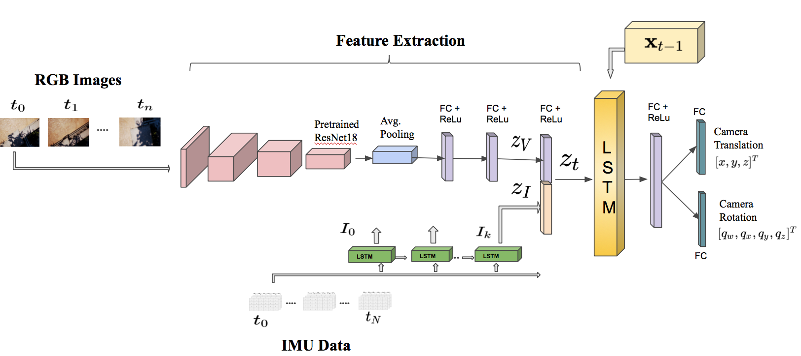

Localization is an essential task for robotics applications. To know the exact pose (position and orientation) of the agent it's essential for visualization, navigation, prediction, and planning.

We propose a new end-to-end approach for online pose estimation that leverages multimodal fusion learning. This consists of a convolutional neural network for image regression and two long short-term memories (LSTMs) of different sizes to account for both sequential and temporal relationships of the input data streams.
A small LSTM architecture integrates arrays of acceleration and angular velocity from the inertial measurements unit sensor. A bigger core LSTM processes visual and inertial feature representations along with the previous vehicle's pose and returns position and orientation estimates at any given time.

In this project I will cover the pipeline used in our paper to localize the pose of the drone using only streams of camera images and IMU data.
I use Python and Pytorch for this project.

# Estimation Problem

Given the actual pose state $ x_t = [x,y,z,q_w,q_x,q_y,q_z]^T \in \mathbf{R}^7 $
we train the neural network to estimate the vehicle pose 
$\hat{x}_t =[\hat{x},\hat{y},\hat{z},\hat{q}_w,\hat{q}_x,\hat{q}_y,\hat{q}_z]^T \in \mathbf{R}^7 $ 
from a continuous stream of images and inertial measurements.

The inputs for our model are observation tuples 
$ y_t =\{ y_I,y_V \} $ 
of RGB images and IMU data, where 
$ y_I = [\tau,a_x,a_y,a_z,\omega_x,\omega_y,\omega_z]^T \in \mathbf{R}^{N \times7} $,
$ \tau $ is the timestamp of the inertial measurement, $ a $ is the linear acceleration, $ \omega $ is the angular velocity, and $ N $ is the number of inertial observation between two consecutive camera frames $ t $ and $ t+1 $.

The online localization task aims to estimate the pose of the vehicle $ x_t $ at any given time given the current observations
$ y_t $ 
and previous pose state 
$ x_{t-1} $
. 

In the learning framework, we aim to model the mapping $ f $ between raw data and the current pose as follows: $ x_t = f(x_{t-1}, y_{t-1}) $, $ f:\mathbf{R}^6, \mathbf{R}^{p \times q} \rightarrow \mathbf{R}^{7} $, where $ p,q $ are the image dimensions.

# The architecture

### Image feature extractor
To encode image features, we use ResNet18, pre-trained on the ImageNet dataset, truncated before the last average pooling layer. Each of the convolutions is followed by batch normalization and the Rectified Linear Unit (ReLU).
We replace the average pooling with global average pooling and subsequently add two inner-product layers. The output is a visual feature vector representation $z_{V}$.

### Inertial feature extraction
IMU measurements are generally available at a rate of an order of magnitude higher (e.g., $~100-200 Hz$) than visual data (e.g., $~10-20 Hz$).
A Long Short-Term Memory (LSTM) processes batches of IMU data (acceleration and angular velocity) between two consecutive image frames and outputs an inertial feature vector $z_I$.
LSTM exploits the temporal dependencies of the input data by maintaining hidden states throughout the window.

### Intermediate fully-connected layer
The inertial feature vector $z_I$ is concatenated with the visual feature representation $ z_V $ into a single feature $ z_t $ representing the motion dynamics of the robot: $ z_t = \mathtt{concat}(z_I, z_V) $.
This vector is then carried over to the core LSTM for sequential modeling.

### Core LSTM
The core LSTM takes as input the motion feature $z_t$ along with its previous hidden states $ h_{t-1} $ and models the dynamics and the connections between sequences of features, where  $ h_t= \mathit{f}(z_t,h_{t-1}) $.  The use of the LSTM module allows for the rapid deployment of visual-inertial pose tracking.
These models can maintain the memory of the hidden states over time and have feedback loops among them. In this way, they enable their hidden state to be related to the previous one, allowing them to learn the connection between the last input and pose state in the sequence.
Finally, the output of the LSTM is carried into a fully-connected layer, which serves as an odometry estimation. The first inner-product layer is of dimension $1024$, and the following two are of dimensions $3$ and $4$ for regressing the translation $x$ and rotation $q$ as quaternions. Overall, the fully connected layer maps the features vector representation $z_t$ into a pose vector as follows:  $x_t = LSTM(z_t, h_{t-1})$.

# The Criterion

We predict the position and orientation of the robot following the work of Kendall et al., with the following modification[kendall2017geometric]. In our loss function, we introduce an additional constraint that penalizes both the $L_1$ and $L_2$ Euclidean norm. Let $x_t= [x,y,z]^T \in \mathbf{R}^3, q_t = [q_w,q_x,q_y,q_z]^T \in \mathbf{R}^4$ be the ground-truth translation and rotation vector, respectively, and $\hat{x}_t, \hat{q}_t$ their estimates. 

Our loss function is as follows: 

$$\mathcal{L}_{\beta}(I)= \mathcal{L}_x(I)+\beta \mathcal{L}_q(I)$$

where $\mathcal{L}_x (I) =\| \hat{x}_t-x_t \| _{L_2} + \gamma \| \hat{x}_t-x_t \| _{L1} $  and $ \mathcal{L}_q (I)= \| \hat{q}_t - \frac{q_t}{\|q_t\|}\| _{L_2} + + \gamma \| \hat{q}_t - \frac{q_t}{\|q_t\|}\| _{L_1} $ represent the translation and the rotation losses. 

$\beta$ is a scale factor that balances the weights of position and orientation, which are expressed in different units, and $\gamma$ is a coefficient introduced to balance the two Euclidean norms. 
However, $\beta$ requires significant tuning to get consistent results, as shown in [kendall2017geometric]. To avoid this issue, we replace $\beta$ by introducing learnable parameters.

The final loss function is as follows: 
 $$   \mathcal{L}_{\sigma}(I)=\mathcal{L}_x(I) \exp \left(-\hat{s}_x\right)+\hat{s}_x+\mathcal{L}_q(I) \exp \left(-\hat{s}_q\right)+\hat{s}_q $$

where $\hat{s} :=\log \hat{\sigma}^{2}$ is the learnable variable and each variable acts as a weight for the respective component in the loss function.

