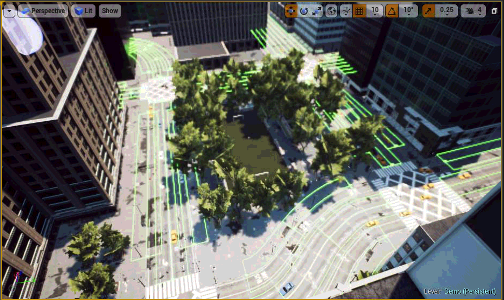

We integrate our data-driven odometry module in a closed-loop flight control system, providing a new method for real-time autonomous navigation and landing. 

To this end, we generate a simulated \textit{Downtown} environment using Airsim, a flight simulator available as a plugin for Unreal Engine [airsim2017fsr]. 

We collect images and inertial measurements flying in the simulated environment and we train the model on the new synthetic dataset. 

The network outputs are now the input to the flight control system that generates velocity commands for the UAV system. 

We show through real-time simulations that our closed-loop data-driven control system can successfully navigate and land the UAV on the designed target with less than $10$ cm of error.

In this project I will show the whole pipeline to integrate our architecture in the AirSim flight control system. 

