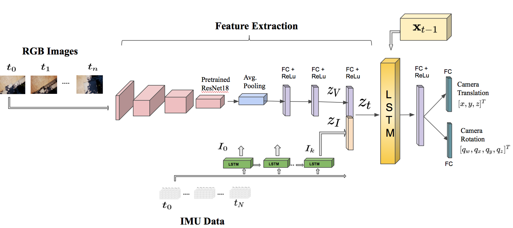
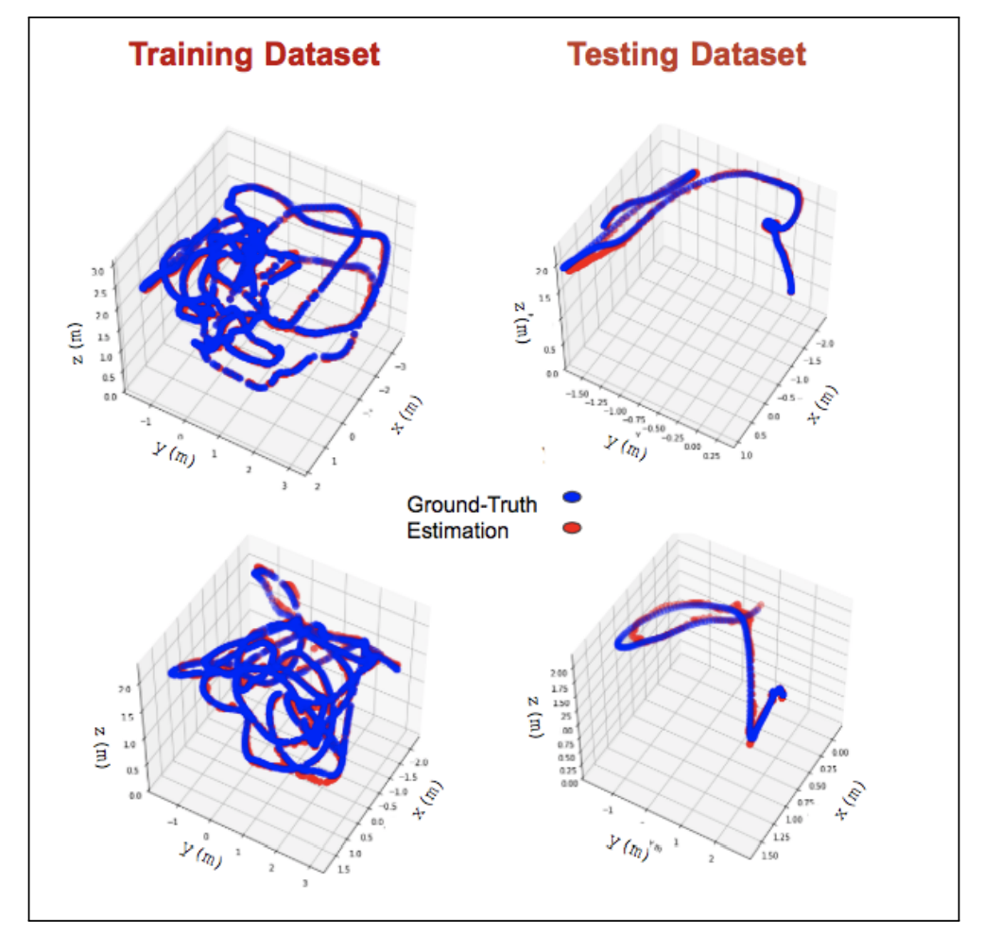

# Abstract

In this work, we propose a new learning approach for autonomous navigation and landing of an Unmanned-Aerial-Vehicle (UAV). We develop a multimodal fusion of deep neural architectures for visual-inertial odometry. We train the model in an end-to-end fashion to estimate the current vehicle pose from streams of visual and inertial measurements.
We first evaluate the accuracy of our estimation by comparing the prediction of the model to traditional algorithms on the publicly available EuRoC MAV dataset. The results illustrate a $25 \%$ improvement in estimation accuracy over the baseline. Finally, we integrate the architecture in the closed-loop flight control system of Airsim - a plugin simulator for Unreal Engine - and we provide simulation results for autonomous navigation and landing.

# The Architecture

We propose a new end-to-end approach for online pose estimation that leverages multimodal fusion learning. This consists of a convolutional neural network for image regression and two long short-term memories (LSTMs) of different sizes to account for both sequential and temporal relationships of the input data streams.A small LSTM architecture integrates arrays of acceleration and angular velocity from the inertial measurements unit sensor. A bigger core LSTM processes visual and inertial feature representations along with the previous vehicle's pose and returns position and orientation estimates at any given time.

 The CNN module determines the most discriminative visual features $ z_V $. A small LSTM module transforms windows batch of inertial measurements collected between two consecutive frames into a single inertial feature vector $ z_I $. The visual and inertial feature vectors are then concatenated in a single representation $ z_t $. 
 
 The core LSTM uses the feature vector  $ z_t $

along with the previous estimate 

$ x_{t-1} $ 

and makes a prediction about the robot pose (translation and rotation).

# The Algorithm

# Integration with the Flight Control System

We integrate our data-driven odometry module in a closed-loop flight control system, providing a new method for real-time autonomous navigation and landing. To this end, we generate a simulated \textit{Downtown} environment using Airsim, a flight simulator available as a plugin for Unreal Engine [airsim2017fsr]. We collect images and inertial measurements flying in the simulated environment and we train the model on the new synthetic dataset. The network outputs are now the input to the flight control system that generates velocity commands for the UAV system. We  show through real-time simulations that our closed-loop data-driven control system can successfully navigate and land the UAV on the designed target with less than $10$ cm of error.

# Benchmarking

 We assess the performance of our model and compare it to a baseline algorithms for visual inertia odometry on the publicly available EuRoC MAV dataset. The results show that our method significantly outperforms the state-of-the-art for odometry estimation, improving the accuracy up to $ 25 \% $ over the baseline.

# AirSim Demo

