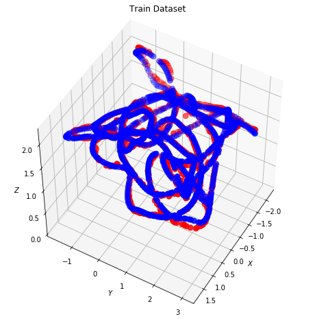
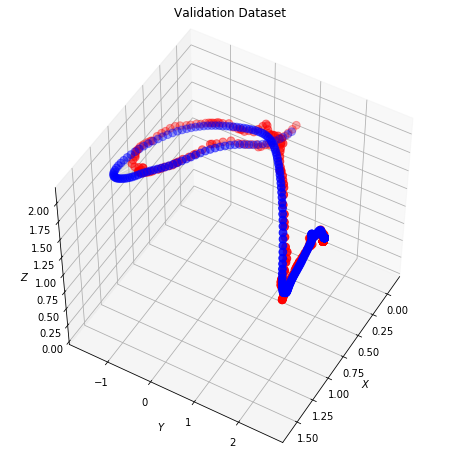

```python
from __future__ import print_function, division

import os
import sys
import time
import glob
import random
import numpy as np
import pandas as pd

from skimage import io, transform
from PIL import Image
from tqdm import tqdm
from datetime import datetime
import argparse
from bisect import bisect_right, bisect_left

import shutil
import torch
import torchvision
import torch.nn.functional as F
import torch.nn as nn
from torchvision import transforms, utils
import torchvision.transforms as transforms
from torchvision.transforms import transforms
from torch.utils.data import DataLoader
from torch.utils.data.dataset import Dataset
from torchvision import transforms
from torch.utils.data.sampler import SubsetRandomSampler
import torchvision.models as models
import torch.optim as optim

# Ignore warnings
import warnings
warnings.filterwarnings("ignore")

%matplotlib inline

plt.ion()   # interactive mode
```

# Import data


```python
## Here some functions used in the dataprocessing 
```


```python
def return_idx(timestamps, data):
    "Return the idx of the timestamp of the camera"
    
    idx_sensor = []
    for temp in timestamps:
        idx=int(data[data['timestamp']==temp].index[0])
        idx_sensor.append(idx)
    return idx_sensor


def return_idx_single(temp, data):
    "Return the idx of the timestamp of the camera"
    
    idx_sensor = []
    idx = data[data['timestamp']==temp].index[0]

    return idx
```

### Import csv data from folders

## Create Dataset and Datalader


```python
imu_data = pd.read_csv('/home/francesca/euroc12/imu0/dadata = pd.read_csv('/home/francesca/euroc12/cam0/daata = pd.read_csv('/home/francesca/euroc12/vicon0/op the first row of the camera
camera_data=camera_data.drop(cmera_data.index[[0]])

# re-assign name to columns
vicon_data.columns = ['timestam','px','py','pz','qw','qx','qy','qz']
camera_data.columns = ['timestamp','filename']
imu_data.columns =['timestamp','wx','wy','wz','ax','ay','az']

# Get the timestamp of the camera and drop the index
camera_timestamps = camera_data['timestamp']
camera_timestamps = camera_timestamps.reset_index(drop=True)

### Interpolate Vicon data to get data at the same timestamp of the camera and IMU
# Vicon data
vicondata = vicon_data.copy() #create a copy

for i in range(len(camera_timestamps)):
    new_row=pd.DataFrame([[camera_timestamps[i],np.nan,np.nan,np.nan,np.nan,np.nan,np.nan,np.nan]], columns = ['timestamp','px','py','pz','qw','qx','qy','qz'])
    vicondata = pd.concat([vicondata, pd.DataFrame(new_row)], ignore_index=True)
    
vicondata.sort_values(by=['timestamp'],inplace=True, ascending=True)
vicondata = vicondata.reset_index(drop = True)
vicondata = vicondata.interpolate()

# Create a new vicon dataframe with the same timestamps of the camera
idx_vicon=return_idx(camera_timestamps,vicondata)
new_vicon = vicondata.ix[idx_vicon].reset_index(drop=True)

vicon_timestamp = new_vicon['timestamp'].values

# Create a new vicon dataframe with the same timestamps of the camera
idx_vicon=return_idx(camera_timestamps,vicondata)
new_vicon = vicondata.ix[idx_vicon].reset_index(drop=True)

vicon_timestamp = new_vicon['timestamp'].values

# Create a new IMU dataframe with the same timestamps of the camera
idx_imu = return_idx(camera_timestamps, imu_data)
new_imu = imu_data.ix[idx_imu].reset_index(drop=True)
imu_timestamp = new_imu['timestamp'].values

# Create new dataframe for images and save it
image_data = pd.merge(camera_data,new_vicon, on='timestamp').reset_index(drop=True)
image_data.to_csv('euroc12/cam0/image_data.csv',index = None, header=True)

file = pd.read_csv('euroc12/cam0/image_data.csv')
file.drop(file.tail(13).index,inplace=True) # drop last n rows
file.to_csv('euroc12/cam0/file.csv',index = None, header=True)


img_name = file.iloc[:, 1]
labels = file.iloc[:, 2:].as_matrix()

c_t = np.array(camera_timestamps)
new_imu_values = np.zeros((len(c_t),10,7))

# Create a new IMU dataframe with the same timestamps of the camera
for i in range(len(c_t)):
    idx_imu = return_idx_single(camera_timestamps.iloc[i], imu_data)
    new_imu_values[i][:][:] = imu_data.ix[idx_imu:idx_imu+9].reset_index(drop=True).values


new_imu_values = new_imu_values[:1696]

# Create new dataframe for images and save it

image_data = pd.merge(camera_data,new_vicon, on='timestamp').reset_index(drop=True)
image_data.to_csv(r'/home/francesca/euroc12/cam0/imag_data.csv',index = None, header=True)
```


    ---------------------------------------------------------------------------

    NameError                                 Traceback (most recent call last)

    <ipython-input-1-29560d1e73f5> in <module>
    ----> 1 imu_data = pd.read_csv('/home/francesca/euroc12/imu0/data.csv')
          2 camera_data = pd.read_csv('/home/francesca/euroc12/cam0/data.csv')
          3 vicon_data = pd.read_csv('/home/francesca/euroc12/vicon0/data.csv')
          4 
          5 # Drop the first row of the camera


    NameError: name 'pd' is not defined


```python
class NewDataset(Dataset):
    def __init__(self, csv_file, imu_data, root_dir):       
        """
        Args:
            csv_file (string): Path to the csv file with annotations.
            root_dir (string): Directory with all the images.
            transform (callable, optional): Optional transform to be applied
                on a sample.
        """
        self.frame = pd.read_csv(csv_file)
        self.imu_data = imu_data
        # Second - 7th columns contains the angular rate and acceleration
        self.imu_arr = self.imu_data[:,:,1:]

        # Second column contains the image name
        self.image_arr = np.asarray(self.frame.iloc[:, 1])
        self.label_arr = np.asarray(self.frame.iloc[:, 2:])
        self.root_dir = root_dir
        # Transforms
        transformation = transforms.Compose([
            transforms.Resize(64),
            transforms.CenterCrop((64,96)),
            transforms.ToTensor(),
            transforms.Normalize([0.4543, 0.4543, 0.4543],[0.3035, 0.3035, 0.3035])
        ])
        self.transform = transformation
        # Calculate len
        self.data_len = len(self.frame.index)
        transform_imu = transforms.Compose([
            transforms.ToTensor(),
        ])
        self.transform_imu = transform_imu
    def __len__(self):
        return self.data_len
    
    def __getitem__(self, idx):
        single_image_name = self.image_arr[idx]
        fp = self.root_dir
        # Open image
        image = Image.open(fp + single_image_name).convert('RGB')
        image = self.transform(image)
        imu_data = self.imu_arr[idx]
        # Get label of the image based on the cropped pandas column
        labels = self.label_arr[idx]

        return image, imu_data, labels
```


```python
dataset = NewDataset(csv_file='euroc12/cam0/file.csv', 
                         imu_data=new_imu_values,
                           root_dir='euroc12/cam0/data/')

dataloader = DataLoader(dataset, batch_size=32,
                        shuffle=False, num_workers=15)
```


```python
batch_size = 32
validation_split = .2
shuffle_dataset = True
random_seed= 42

# Creating data indices for training and validation splits:
dataset_size = len(dataset)
indices = list(range(dataset_size))
split = int(np.floor(validation_split * dataset_size))
# split = 320
if shuffle_dataset :
    np.random.seed(random_seed)
    np.random.shuffle(indices)
train_indices, val_indices = indices[split:], indices[:split]

# Creating PT data samplers and loaders:
train_sampler = SubsetRandomSampler(train_indices)
valid_sampler = SubsetRandomSampler(val_indices)

train_loader = torch.utils.data.DataLoader(dataset, batch_size=batch_size, 
                                           sampler=train_sampler)
validation_loader_1 = torch.utils.data.DataLoader(dataset, batch_size=batch_size,
                                                sampler=valid_sampler)
```

## The network Model


```python
def quaternion_angular_error(q1, q2):
    """
    angular error between two quaternions
    :param q1: (4, )
    :param q2: (4, )
    :return:
    """
    d = abs(np.dot(q1, q2))
    abs_q1 = np.linalg.norm(q1)
    abs_q2 = np.linalg.norm(q2)
    d = d / (abs_q1 * abs_q2)
    d = min(1.0, max(-1.0, d))
    theta = 2 * np.arccos(d) * 180 / np.pi
    return theta
```


```python
class Flatten(nn.Module):
    def forward(self, input):
        return input.view(input.size(0), -1)

class UnFlatten(nn.Module):
    def forward(self, input):
        return input.view(input.size(0), -1, 1, 1)


class FlattenIMU(nn.Module):
    def forward(self, input):
        return input.view(32, -1)

class IMUNet(torch.nn.Module):
    
    def __init__(self, feature_extractor, num_features=128, dropout=0.5,
                 track_running_stats=False, pretrained=False):
        super(IMUNet, self).__init__()
        self.dropout = dropout
        self.feature_extractor = feature_extractor
        self.feature_extractor.avgpool = torch.nn.AdaptiveAvgPool2d(1)
        fc_in_features = self.feature_extractor.fc.in_features
        
        
        self.IMU_fc = nn.Sequential(
            Flatten(),
            nn.Linear(7, 1024),
            nn.ReLU(),
            nn.Linear(1024, 32),
            nn.ReLU(),
            FlattenIMU()
        )
        
        self.rnn = torch.nn.LSTM(
            input_size=6, 
            hidden_size= 64*2, 
            num_layers=4,
            batch_first=True)
        
        self.flat_imu = FlattenIMU()
        self.linear = nn.Linear(128,num_features)

        self.fc3 = torch.nn.Linear( 4096, num_features)
        self.feature_extractor.fc = torch.nn.Linear(fc_in_features, num_features)
        # Translation
        self.fc_xyz = torch.nn.Linear(num_features, 3)

        # Rotation in quaternions
        self.fc_quat = torch.nn.Linear(num_features, 4)
        
    def extract_features(self, image):
        x_features = self.feature_extractor(image)
        x_features = F.relu(x_features)
        if self.dropout > 0:
            x_features = F.dropout(x_features, p=self.dropout, training=self.training)
        return x_features
    
    def forward(self, data_input):
        image = data_input[0].cuda()
        imu_data = data_input[1].type(torch.FloatTensor).cuda()
        #Images
        if type(image) is list:
            x_features = [self.extract_features(xi) for xi in image]
        elif torch.is_tensor(image):
            x_features = self.extract_features(image)
            
        imu_feat = imu_data
        r_out, (h_n, h_c) = self.rnn(imu_feat)
        imu_out = self.linear(r_out[:, -1, :]) # we want just the last time 


        imu_out = self.flat_imu(imu_out) # we want just the last time 
    
        x = torch.cat((x_features, imu_out), dim=1)
        x = F.relu(self.fc3(x))

        if type(x) is list:
            x_translations = [self.fc_xyz(xi) for xi in x]
            x_rotations = [self.fc_quat(xi) for xi in x]
            x_poses = [torch.cat((xt, xr), dim=1) for xt, xr in zip(x_translations, x_rotations)]  
        elif torch.is_tensor(x):
            x_translations = self.fc_xyz(x) 
            x_rotations = self.fc_quat(x)
            x_poses = torch.cat((x_translations, x_rotations), dim=1)

        return x_poses

class AverageMeter():
    def __init__(self):
        self.reset()

    def reset(self):
        self.val = 0
        self.avg = 0
        self.sum = 0
        self.count = 0

    def update(self, value, n=1):
        self.val = value
        self.count += n
        self.sum += value * n
        self.avg = self.sum / self.count
```

## The Loss Criterion


```python
# set the device
device = torch.device('cuda' if torch.cuda.is_available() else 'cpu')

# Create pretrained feature extractor
feature_extractor = models.resnet18(pretrained=True)

# Num features for the last layer before pose regressor
num_features = 2048

# Create model
model = IMUNet(feature_extractor, num_features=num_features, pretrained=True)
model = model.to(device)


# Create pretrained feature extractor
feature_extractor = models.resnet18(pretrained=True)
```


```python
### Training and Validatin functions
```


```python
class NetCriterion(torch.nn.Module):
    def __init__(self, beta = 512.0, learn_beta=True, sx=0.0, sq=1.0):
        super(NetCriterion, self).__init__()
        self.loss_fn1 = torch.nn.L1Loss()
        self.loss_fn = torch.nn.MSELoss()
        self.learn_beta = learn_beta
        if not learn_beta:
            self.beta = beta
        else:
            self.beta = 1.0
        self.sx = torch.nn.Parameter(torch.Tensor([sx]), requires_grad=learn_beta)
        self.sq = torch.nn.Parameter(torch.Tensor([sq]), requires_grad=learn_beta)

    def forward(self, x, y):
        """
        Args:
            x: list(N x 7, N x 7) - prediction (xyz, quat)
            y: list(N x 7, N x 7) - target (xyz, quat)
        """
        
        loss = 0
        # Translation loss
        loss = torch.exp(-self.sx) * (self.loss_fn(x[:, :3], y[:, :3])+0.01*self.loss_fn1(x[:, :3], y[:, :3])) 
        # Rotation loss
        loss += torch.exp(-self.sq) * self.beta * self.loss_fn(x[:, 3:], y[:, 3:]+0.01*self.loss_fn1(x[:, 3:], y[:, 3:])) + self.sq

        return loss
```

## Train the network


```python
def train(train_loader, model, criterion, optimizer, epoch, max_epoch, log_freq=1, print_sum=True):
    
    position_loss=[]
    orientation_loss = []
    
    model.train()
    losses = AverageMeter()
    epoch_time = time.time()
    
    gt_poses = np.empty((0, 7))
    pred_poses = np.empty((0, 7))
    
    end = time.time()
    
    for idx, data in enumerate(train_loader):
        if idx == 1920:
            idx = 1919
        batch_images= data[0].cuda()
        imu_data= data[1].unsqueeze(0).cuda()
    
        batch_poses= data[2].cuda()
        data_time = (time.time() - end)
        batch_images = batch_images.to(device)
        batch_poses = batch_poses.to(device)
        batch_poses = torch.tensor(batch_poses, dtype=torch.float, device=device)
        imu_data = torch.tensor(imu_data, dtype=torch.float, device=device)

        out = model(data[0:2])
        loss = criterion(out, batch_poses)
        
        # Training step
        optimizer.zero_grad()
        loss.backward()
        optimizer.step()
        losses.update(loss.data[0], len(batch_images) * batch_images.size(0))
        
        
        # move data to cpu & numpy
        bp = batch_poses.detach().cpu().numpy()
        outp = out.detach().cpu().numpy()
        gt_poses = np.vstack((gt_poses, bp))
        pred_poses = np.vstack((pred_poses, outp))
        
        batch_time = (time.time() - end)
        end = time.time()
        
        if log_freq != 0 and idx % log_freq == 0:
            print('Epoch: [{}/{}]\tBatch: [{}/{}]\t'
                  'Time: {batch_time:.3f}\t'
                  'Data Time: {data_time:.3f}\t'
                  'Loss: {losses.val:.3f}\t'
                  'Avg Loss: {losses.avg:.3f}\t'.format(
                   epoch, max_epoch - 1, idx, len(train_loader) - 1,
                   batch_time=batch_time, data_time=data_time, losses=losses))
            
        t_loss = np.asarray([np.linalg.norm(p - t) for p, t in zip(pred_poses[:, :3], gt_poses[:, :3])])
        q_loss = np.asarray([quaternion_angular_error(p, t) for p, t in zip(pred_poses[:, 3:], gt_poses[:, 3:])])
    position_loss.append(t_loss)
    orientation_loss.append(q_loss)
        
    return losses
    
def validate(val_loader, model, criterion, epoch, log_freq=1, print_sum=True):
    
    losses = AverageMeter()
    position_loss_testing=[]
    orientation_loss_testing=[]
    
    # set model to evaluation
    model.eval()
    
    with torch.no_grad():
        epoch_time = time.time()
        end = time.time()
        for idx, data in enumerate(val_loader):


            batch_images= data[0].cuda()
            imu_data= data[1].cuda()
        
            batch_poses= data[2].cuda()
            data_time = time.time() - end
            
            batch_images = batch_images.to(device)
            batch_poses = batch_poses.to(device)
            batch_poses = torch.tensor(batch_poses, dtype=torch.float, device=device)
            imu_data = imu_data.to(device)
            imu_data = torch.tensor(imu_data, dtype=torch.float, device=device)

            # compute model output
            out = model(data[:2])
            loss = criterion(out, batch_poses)
            
            losses.update(loss.data[0], len(data[0]) * data[0].size(0))
            batch_time = time.time() - end
            end = time.time()
            if log_freq != 0 and idx % log_freq == 0:
                print('Val Epoch: {}\t'
                      'Time: {batch_time:.3f}\t'
                      'Data Time: {data_time:.3f}\t'
                      'Loss: {losses.val:.3f}\t'
                      'Avg Loss: {losses.avg:.3f}'.format(
                       epoch, batch_time=batch_time, data_time=data_time, losses=losses))

    return losses

```

## Let's plot the results! 


```python
imu = next(iter(train_loader))[1]
# Create model
model = IMUNet(feature_extractor, num_features=num_features, pretrained=True)
model = model.to(device)

# Criterion
criterion = NetCriterion(learn_beta=True)
criterion = criterion.to(device)

# Add all params for optimization
param_list = [{'params': model.parameters()}]
if criterion.learn_beta:
    param_list.append({'params': criterion.parameters()})

# Create optimizer
# optimizer = optim.Adam(params=param_list, lr=1e-5, weight_decay=0.0005)
optimizer = optim.Adam(params=param_list, lr=0.0001, weight_decay=0.0001)


# Epochs to train
start_epoch = 0
n_epochs = 10

train_loss=[]
test_loss=[]
print('Training ...')
val_freq = 10
for e in range(start_epoch, n_epochs):
    losses = train(train_loader, model, criterion, optimizer, e, n_epochs, log_freq=100)
    train_loss.append(losses)
    if losses.val <= 0:
        break
    if e % val_freq == 0:
        loss = validate(validation_loader, model, criterion, e, log_freq=100)
        test_loss.append(loss)

torch.save(model, 'LSTM_pos_workin2_v2.torch')
print('n_epochs = {}'.format(n_epochs))


```

    Training ...
    Epoch: [0/619]	Batch: [0/42]	Time: 0.331	Data Time: 0.221	Loss: 3.353	Avg Loss: 3.353	
    Val Epoch: 0	Time: 0.251	Data Time: 0.186	Loss: 1.148	Avg Loss: 1.148
    Epoch: [1/619]	Batch: [0/42]	Time: 0.289	Data Time: 0.174	Loss: 1.191	Avg Loss: 1.191	
    Epoch: [2/619]	Batch: [0/42]	Time: 0.275	Data Time: 0.176	Loss: 1.090	Avg Loss: 1.090	
    Epoch: [3/619]	Batch: [0/42]	Time: 0.274	Data Time: 0.178	Loss: 1.075	Avg Loss: 1.075	
    Epoch: [4/619]	Batch: [0/42]	Time: 0.292	Data Time: 0.181	Loss: 1.038	Avg Loss: 1.038	
    Epoch: [5/619]	Batch: [0/42]	Time: 0.296	Data Time: 0.185	Loss: 1.026	Avg Loss: 1.026	
    Epoch: [6/619]	Batch: [0/42]	Time: 0.314	Data Time: 0.190	Loss: 1.021	Avg Loss: 1.021	
    Epoch: [7/619]	Batch: [0/42]	Time: 0.343	Data Time: 0.203	Loss: 1.020	Avg Loss: 1.020	
    Epoch: [8/619]	Batch: [0/42]	Time: 0.306	Data Time: 0.177	Loss: 1.027	Avg Loss: 1.027	
    Epoch: [9/619]	Batch: [0/42]	Time: 0.289	Data Time: 0.178	Loss: 0.988	Avg Loss: 0.988	
    Epoch: [10/619]	Batch: [0/42]	Time: 0.275	Data Time: 0.174	Loss: 0.990	Avg Loss: 0.990	
    Val Epoch: 10	Time: 0.293	Data Time: 0.230	Loss: 0.963	Avg Loss: 0.963
    Epoch: [11/619]	Batch: [0/42]	Time: 0.275	Data Time: 0.181	Loss: 0.997	Avg Loss: 0.997	
    Epoch: [12/619]	Batch: [0/42]	Time: 0.298	Data Time: 0.194	Loss: 0.971	Avg Loss: 0.971	
    Epoch: [13/619]	Batch: [0/42]	Time: 0.280	Data Time: 0.189	Loss: 0.956	Avg Loss: 0.956	
    Epoch: [14/619]	Batch: [0/42]	Time: 0.306	Data Time: 0.181	Loss: 0.958	Avg Loss: 0.958	
    Epoch: [15/619]	Batch: [0/42]	Time: 0.284	Data Time: 0.178	Loss: 0.966	Avg Loss: 0.966	
    Epoch: [16/619]	Batch: [0/42]	Time: 0.359	Data Time: 0.226	Loss: 0.950	Avg Loss: 0.950	
    Epoch: [17/619]	Batch: [0/42]	Time: 0.290	Data Time: 0.180	Loss: 0.944	Avg Loss: 0.944	
    Epoch: [18/619]	Batch: [0/42]	Time: 0.387	Data Time: 0.265	Loss: 0.936	Avg Loss: 0.936	
    Epoch: [19/619]	Batch: [0/42]	Time: 0.323	Data Time: 0.215	Loss: 0.933	Avg Loss: 0.933	
    Epoch: [20/619]	Batch: [0/42]	Time: 0.287	Data Time: 0.185	Loss: 0.947	Avg Loss: 0.947	
    Val Epoch: 20	Time: 0.249	Data Time: 0.180	Loss: 0.914	Avg Loss: 0.914
    Epoch: [21/619]	Batch: [0/42]	Time: 0.273	Data Time: 0.181	Loss: 0.927	Avg Loss: 0.927	
    Epoch: [22/619]	Batch: [0/42]	Time: 0.361	Data Time: 0.264	Loss: 0.920	Avg Loss: 0.920	
    Epoch: [23/619]	Batch: [0/42]	Time: 0.319	Data Time: 0.184	Loss: 0.914	Avg Loss: 0.914	
    Epoch: [24/619]	Batch: [0/42]	Time: 0.308	Data Time: 0.187	Loss: 0.905	Avg Loss: 0.905	
    Epoch: [25/619]	Batch: [0/42]	Time: 0.288	Data Time: 0.189	Loss: 0.907	Avg Loss: 0.907	
    Epoch: [26/619]	Batch: [0/42]	Time: 0.284	Data Time: 0.183	Loss: 0.902	Avg Loss: 0.902	
    Epoch: [27/619]	Batch: [0/42]	Time: 0.307	Data Time: 0.183	Loss: 0.896	Avg Loss: 0.896	
    Epoch: [28/619]	Batch: [0/42]	Time: 0.231	Data Time: 0.175	Loss: 0.892	Avg Loss: 0.892	
    Epoch: [29/619]	Batch: [0/42]	Time: 0.296	Data Time: 0.207	Loss: 0.888	Avg Loss: 0.888	
    Epoch: [30/619]	Batch: [0/42]	Time: 0.281	Data Time: 0.183	Loss: 0.882	Avg Loss: 0.882	
    Val Epoch: 30	Time: 0.243	Data Time: 0.183	Loss: 0.873	Avg Loss: 0.873
    Epoch: [31/619]	Batch: [0/42]	Time: 0.282	Data Time: 0.176	Loss: 0.880	Avg Loss: 0.880	
    Epoch: [32/619]	Batch: [0/42]	Time: 0.316	Data Time: 0.181	Loss: 0.870	Avg Loss: 0.870	
    Epoch: [33/619]	Batch: [0/42]	Time: 0.290	Data Time: 0.179	Loss: 0.870	Avg Loss: 0.870	
    Epoch: [34/619]	Batch: [0/42]	Time: 0.305	Data Time: 0.172	Loss: 0.862	Avg Loss: 0.862	
    Epoch: [35/619]	Batch: [0/42]	Time: 0.293	Data Time: 0.183	Loss: 0.862	Avg Loss: 0.862	
    Epoch: [36/619]	Batch: [0/42]	Time: 0.302	Data Time: 0.175	Loss: 0.856	Avg Loss: 0.856	
    Epoch: [37/619]	Batch: [0/42]	Time: 0.298	Data Time: 0.175	Loss: 0.850	Avg Loss: 0.850	
    Epoch: [38/619]	Batch: [0/42]	Time: 0.282	Data Time: 0.176	Loss: 0.842	Avg Loss: 0.842	
    Epoch: [39/619]	Batch: [0/42]	Time: 0.251	Data Time: 0.173	Loss: 0.838	Avg Loss: 0.838	
    Epoch: [40/619]	Batch: [0/42]	Time: 0.288	Data Time: 0.189	Loss: 0.841	Avg Loss: 0.841	
    Val Epoch: 40	Time: 0.260	Data Time: 0.193	Loss: 0.828	Avg Loss: 0.828
    Epoch: [41/619]	Batch: [0/42]	Time: 0.275	Data Time: 0.180	Loss: 0.831	Avg Loss: 0.831	
    Epoch: [42/619]	Batch: [0/42]	Time: 0.287	Data Time: 0.179	Loss: 0.827	Avg Loss: 0.827	
    Epoch: [43/619]	Batch: [0/42]	Time: 0.309	Data Time: 0.180	Loss: 0.822	Avg Loss: 0.822	
    Epoch: [44/619]	Batch: [0/42]	Time: 0.312	Data Time: 0.180	Loss: 0.823	Avg Loss: 0.823	
    Epoch: [45/619]	Batch: [0/42]	Time: 0.284	Data Time: 0.181	Loss: 0.816	Avg Loss: 0.816	
    Epoch: [46/619]	Batch: [0/42]	Time: 0.320	Data Time: 0.188	Loss: 0.810	Avg Loss: 0.810	
    Epoch: [47/619]	Batch: [0/42]	Time: 0.307	Data Time: 0.178	Loss: 0.804	Avg Loss: 0.804	
    Epoch: [48/619]	Batch: [0/42]	Time: 0.308	Data Time: 0.183	Loss: 0.801	Avg Loss: 0.801	
    Epoch: [49/619]	Batch: [0/42]	Time: 0.300	Data Time: 0.184	Loss: 0.802	Avg Loss: 0.802	
    Epoch: [50/619]	Batch: [0/42]	Time: 0.306	Data Time: 0.187	Loss: 0.792	Avg Loss: 0.792	
    Val Epoch: 50	Time: 0.239	Data Time: 0.188	Loss: 0.782	Avg Loss: 0.782
    Epoch: [51/619]	Batch: [0/42]	Time: 0.319	Data Time: 0.180	Loss: 0.786	Avg Loss: 0.786	
    Epoch: [52/619]	Batch: [0/42]	Time: 0.419	Data Time: 0.285	Loss: 0.785	Avg Loss: 0.785	
    Epoch: [53/619]	Batch: [0/42]	Time: 0.341	Data Time: 0.217	Loss: 0.785	Avg Loss: 0.785	
    Epoch: [54/619]	Batch: [0/42]	Time: 0.292	Data Time: 0.185	Loss: 0.774	Avg Loss: 0.774	
    Epoch: [55/619]	Batch: [0/42]	Time: 0.313	Data Time: 0.178	Loss: 0.769	Avg Loss: 0.769	
    Epoch: [56/619]	Batch: [0/42]	Time: 0.317	Data Time: 0.179	Loss: 0.764	Avg Loss: 0.764	
    Epoch: [57/619]	Batch: [0/42]	Time: 0.316	Data Time: 0.200	Loss: 0.764	Avg Loss: 0.764	
    Epoch: [58/619]	Batch: [0/42]	Time: 0.311	Data Time: 0.182	Loss: 0.756	Avg Loss: 0.756	
    Epoch: [59/619]	Batch: [0/42]	Time: 0.299	Data Time: 0.191	Loss: 0.752	Avg Loss: 0.752	
    Epoch: [60/619]	Batch: [0/42]	Time: 0.317	Data Time: 0.185	Loss: 0.747	Avg Loss: 0.747	
    Val Epoch: 60	Time: 0.242	Data Time: 0.185	Loss: 0.739	Avg Loss: 0.739
    Epoch: [61/619]	Batch: [0/42]	Time: 0.405	Data Time: 0.277	Loss: 0.743	Avg Loss: 0.743	
    Epoch: [62/619]	Batch: [0/42]	Time: 0.331	Data Time: 0.189	Loss: 0.738	Avg Loss: 0.738	
    Epoch: [63/619]	Batch: [0/42]	Time: 0.291	Data Time: 0.196	Loss: 0.735	Avg Loss: 0.735	
    Epoch: [64/619]	Batch: [0/42]	Time: 0.310	Data Time: 0.180	Loss: 0.728	Avg Loss: 0.728	
    Epoch: [65/619]	Batch: [0/42]	Time: 0.376	Data Time: 0.245	Loss: 0.725	Avg Loss: 0.725	
    Epoch: [66/619]	Batch: [0/42]	Time: 0.334	Data Time: 0.218	Loss: 0.723	Avg Loss: 0.723	
    Epoch: [67/619]	Batch: [0/42]	Time: 0.321	Data Time: 0.183	Loss: 0.716	Avg Loss: 0.716	
    Epoch: [68/619]	Batch: [0/42]	Time: 0.274	Data Time: 0.180	Loss: 0.712	Avg Loss: 0.712	
    Epoch: [69/619]	Batch: [0/42]	Time: 0.294	Data Time: 0.188	Loss: 0.706	Avg Loss: 0.706	
    Epoch: [70/619]	Batch: [0/42]	Time: 0.322	Data Time: 0.207	Loss: 0.703	Avg Loss: 0.703	
    Val Epoch: 70	Time: 0.281	Data Time: 0.189	Loss: 0.696	Avg Loss: 0.696
    Epoch: [71/619]	Batch: [0/42]	Time: 0.310	Data Time: 0.173	Loss: 0.699	Avg Loss: 0.699	
    Epoch: [72/619]	Batch: [0/42]	Time: 0.294	Data Time: 0.178	Loss: 0.698	Avg Loss: 0.698	
    Epoch: [73/619]	Batch: [0/42]	Time: 0.317	Data Time: 0.187	Loss: 0.690	Avg Loss: 0.690	
    Epoch: [74/619]	Batch: [0/42]	Time: 0.294	Data Time: 0.176	Loss: 0.687	Avg Loss: 0.687	
    Epoch: [75/619]	Batch: [0/42]	Time: 0.312	Data Time: 0.178	Loss: 0.683	Avg Loss: 0.683	
    Epoch: [76/619]	Batch: [0/42]	Time: 0.309	Data Time: 0.180	Loss: 0.678	Avg Loss: 0.678	
    Epoch: [77/619]	Batch: [0/42]	Time: 0.345	Data Time: 0.241	Loss: 0.672	Avg Loss: 0.672	
    Epoch: [78/619]	Batch: [0/42]	Time: 0.319	Data Time: 0.179	Loss: 0.669	Avg Loss: 0.669	
    Epoch: [79/619]	Batch: [0/42]	Time: 0.304	Data Time: 0.181	Loss: 0.666	Avg Loss: 0.666	
    Epoch: [80/619]	Batch: [0/42]	Time: 0.307	Data Time: 0.175	Loss: 0.663	Avg Loss: 0.663	
    Val Epoch: 80	Time: 0.264	Data Time: 0.184	Loss: 0.653	Avg Loss: 0.653
    Epoch: [81/619]	Batch: [0/42]	Time: 0.320	Data Time: 0.185	Loss: 0.655	Avg Loss: 0.655	
    Epoch: [82/619]	Batch: [0/42]	Time: 0.304	Data Time: 0.177	Loss: 0.653	Avg Loss: 0.653	
    Epoch: [83/619]	Batch: [0/42]	Time: 0.314	Data Time: 0.202	Loss: 0.647	Avg Loss: 0.647	
    Epoch: [84/619]	Batch: [0/42]	Time: 0.304	Data Time: 0.177	Loss: 0.645	Avg Loss: 0.645	
    Epoch: [85/619]	Batch: [0/42]	Time: 0.314	Data Time: 0.183	Loss: 0.640	Avg Loss: 0.640	
    Epoch: [86/619]	Batch: [0/42]	Time: 0.285	Data Time: 0.173	Loss: 0.636	Avg Loss: 0.636	
    Epoch: [87/619]	Batch: [0/42]	Time: 0.289	Data Time: 0.187	Loss: 0.629	Avg Loss: 0.629	
    Epoch: [88/619]	Batch: [0/42]	Time: 0.310	Data Time: 0.186	Loss: 0.626	Avg Loss: 0.626	
    Epoch: [89/619]	Batch: [0/42]	Time: 0.312	Data Time: 0.184	Loss: 0.622	Avg Loss: 0.622	
    Epoch: [90/619]	Batch: [0/42]	Time: 0.271	Data Time: 0.172	Loss: 0.618	Avg Loss: 0.618	
    Val Epoch: 90	Time: 0.273	Data Time: 0.181	Loss: 0.611	Avg Loss: 0.611
    Epoch: [91/619]	Batch: [0/42]	Time: 0.312	Data Time: 0.186	Loss: 0.613	Avg Loss: 0.613	
    Epoch: [92/619]	Batch: [0/42]	Time: 0.297	Data Time: 0.179	Loss: 0.609	Avg Loss: 0.609	
    Epoch: [93/619]	Batch: [0/42]	Time: 0.323	Data Time: 0.180	Loss: 0.609	Avg Loss: 0.609	
    Epoch: [94/619]	Batch: [0/42]	Time: 0.328	Data Time: 0.177	Loss: 0.601	Avg Loss: 0.601	
    Epoch: [95/619]	Batch: [0/42]	Time: 0.295	Data Time: 0.176	Loss: 0.596	Avg Loss: 0.596	
    Epoch: [96/619]	Batch: [0/42]	Time: 0.317	Data Time: 0.177	Loss: 0.591	Avg Loss: 0.591	
    Epoch: [97/619]	Batch: [0/42]	Time: 0.342	Data Time: 0.190	Loss: 0.585	Avg Loss: 0.585	
    Epoch: [98/619]	Batch: [0/42]	Time: 0.312	Data Time: 0.188	Loss: 0.583	Avg Loss: 0.583	
    Epoch: [99/619]	Batch: [0/42]	Time: 0.338	Data Time: 0.187	Loss: 0.581	Avg Loss: 0.581	
    Epoch: [100/619]	Batch: [0/42]	Time: 0.334	Data Time: 0.186	Loss: 0.575	Avg Loss: 0.575	
    Val Epoch: 100	Time: 0.277	Data Time: 0.184	Loss: 0.567	Avg Loss: 0.567
    Epoch: [101/619]	Batch: [0/42]	Time: 0.327	Data Time: 0.174	Loss: 0.570	Avg Loss: 0.570	
    Epoch: [102/619]	Batch: [0/42]	Time: 0.313	Data Time: 0.181	Loss: 0.566	Avg Loss: 0.566	
    Epoch: [103/619]	Batch: [0/42]	Time: 0.387	Data Time: 0.267	Loss: 0.560	Avg Loss: 0.560	
    Epoch: [104/619]	Batch: [0/42]	Time: 0.302	Data Time: 0.176	Loss: 0.556	Avg Loss: 0.556	
    Epoch: [105/619]	Batch: [0/42]	Time: 0.334	Data Time: 0.187	Loss: 0.553	Avg Loss: 0.553	
    Epoch: [106/619]	Batch: [0/42]	Time: 0.311	Data Time: 0.187	Loss: 0.550	Avg Loss: 0.550	
    Epoch: [107/619]	Batch: [0/42]	Time: 0.333	Data Time: 0.185	Loss: 0.544	Avg Loss: 0.544	
    Epoch: [108/619]	Batch: [0/42]	Time: 0.325	Data Time: 0.187	Loss: 0.539	Avg Loss: 0.539	
    Epoch: [109/619]	Batch: [0/42]	Time: 0.311	Data Time: 0.177	Loss: 0.535	Avg Loss: 0.535	
    Epoch: [110/619]	Batch: [0/42]	Time: 0.295	Data Time: 0.175	Loss: 0.530	Avg Loss: 0.530	
    Val Epoch: 110	Time: 0.255	Data Time: 0.185	Loss: 0.526	Avg Loss: 0.526
    Epoch: [111/619]	Batch: [0/42]	Time: 0.313	Data Time: 0.190	Loss: 0.527	Avg Loss: 0.527	
    Epoch: [112/619]	Batch: [0/42]	Time: 0.307	Data Time: 0.194	Loss: 0.522	Avg Loss: 0.522	
    Epoch: [113/619]	Batch: [0/42]	Time: 0.273	Data Time: 0.181	Loss: 0.518	Avg Loss: 0.518	
    Epoch: [114/619]	Batch: [0/42]	Time: 0.292	Data Time: 0.187	Loss: 0.514	Avg Loss: 0.514	
    Epoch: [115/619]	Batch: [0/42]	Time: 0.293	Data Time: 0.182	Loss: 0.511	Avg Loss: 0.511	
    Epoch: [116/619]	Batch: [0/42]	Time: 0.313	Data Time: 0.187	Loss: 0.505	Avg Loss: 0.505	
    Epoch: [117/619]	Batch: [0/42]	Time: 0.302	Data Time: 0.177	Loss: 0.502	Avg Loss: 0.502	
    Epoch: [118/619]	Batch: [0/42]	Time: 0.292	Data Time: 0.181	Loss: 0.498	Avg Loss: 0.498	
    Epoch: [119/619]	Batch: [0/42]	Time: 0.325	Data Time: 0.181	Loss: 0.493	Avg Loss: 0.493	
    Epoch: [120/619]	Batch: [0/42]	Time: 0.292	Data Time: 0.189	Loss: 0.488	Avg Loss: 0.488	
    Val Epoch: 120	Time: 0.267	Data Time: 0.184	Loss: 0.483	Avg Loss: 0.483
    Epoch: [121/619]	Batch: [0/42]	Time: 0.298	Data Time: 0.177	Loss: 0.485	Avg Loss: 0.485	
    Epoch: [122/619]	Batch: [0/42]	Time: 0.297	Data Time: 0.182	Loss: 0.480	Avg Loss: 0.480	
    Epoch: [123/619]	Batch: [0/42]	Time: 0.300	Data Time: 0.176	Loss: 0.474	Avg Loss: 0.474	
    Epoch: [124/619]	Batch: [0/42]	Time: 0.332	Data Time: 0.186	Loss: 0.473	Avg Loss: 0.473	
    Epoch: [125/619]	Batch: [0/42]	Time: 0.302	Data Time: 0.178	Loss: 0.468	Avg Loss: 0.468	
    Epoch: [126/619]	Batch: [0/42]	Time: 0.336	Data Time: 0.191	Loss: 0.463	Avg Loss: 0.463	
    Epoch: [127/619]	Batch: [0/42]	Time: 0.326	Data Time: 0.185	Loss: 0.457	Avg Loss: 0.457	
    Epoch: [128/619]	Batch: [0/42]	Time: 0.359	Data Time: 0.226	Loss: 0.455	Avg Loss: 0.455	
    Epoch: [129/619]	Batch: [0/42]	Time: 0.359	Data Time: 0.222	Loss: 0.448	Avg Loss: 0.448	
    Epoch: [130/619]	Batch: [0/42]	Time: 0.289	Data Time: 0.187	Loss: 0.446	Avg Loss: 0.446	
    Val Epoch: 130	Time: 0.283	Data Time: 0.187	Loss: 0.438	Avg Loss: 0.438
    Epoch: [131/619]	Batch: [0/42]	Time: 0.332	Data Time: 0.183	Loss: 0.441	Avg Loss: 0.441	
    Epoch: [132/619]	Batch: [0/42]	Time: 0.322	Data Time: 0.198	Loss: 0.438	Avg Loss: 0.438	
    Epoch: [133/619]	Batch: [0/42]	Time: 0.304	Data Time: 0.180	Loss: 0.431	Avg Loss: 0.431	
    Epoch: [134/619]	Batch: [0/42]	Time: 0.324	Data Time: 0.188	Loss: 0.427	Avg Loss: 0.427	
    Epoch: [135/619]	Batch: [0/42]	Time: 0.308	Data Time: 0.182	Loss: 0.423	Avg Loss: 0.423	
    Epoch: [136/619]	Batch: [0/42]	Time: 0.308	Data Time: 0.188	Loss: 0.418	Avg Loss: 0.418	
    Epoch: [137/619]	Batch: [0/42]	Time: 0.287	Data Time: 0.178	Loss: 0.419	Avg Loss: 0.419	
    Epoch: [138/619]	Batch: [0/42]	Time: 0.280	Data Time: 0.174	Loss: 0.413	Avg Loss: 0.413	
    Epoch: [139/619]	Batch: [0/42]	Time: 0.321	Data Time: 0.187	Loss: 0.406	Avg Loss: 0.406	
    Epoch: [140/619]	Batch: [0/42]	Time: 0.308	Data Time: 0.183	Loss: 0.416	Avg Loss: 0.416	
    Val Epoch: 140	Time: 0.258	Data Time: 0.191	Loss: 0.425	Avg Loss: 0.425
    Epoch: [141/619]	Batch: [0/42]	Time: 0.328	Data Time: 0.202	Loss: 0.432	Avg Loss: 0.432	
    Epoch: [142/619]	Batch: [0/42]	Time: 0.341	Data Time: 0.222	Loss: 0.407	Avg Loss: 0.407	
    Epoch: [143/619]	Batch: [0/42]	Time: 0.296	Data Time: 0.172	Loss: 0.399	Avg Loss: 0.399	
    Epoch: [144/619]	Batch: [0/42]	Time: 0.292	Data Time: 0.181	Loss: 0.386	Avg Loss: 0.386	
    Epoch: [145/619]	Batch: [0/42]	Time: 0.317	Data Time: 0.180	Loss: 0.383	Avg Loss: 0.383	
    Epoch: [146/619]	Batch: [0/42]	Time: 0.346	Data Time: 0.199	Loss: 0.383	Avg Loss: 0.383	
    Epoch: [147/619]	Batch: [0/42]	Time: 0.287	Data Time: 0.183	Loss: 0.374	Avg Loss: 0.374	
    Epoch: [148/619]	Batch: [0/42]	Time: 0.278	Data Time: 0.178	Loss: 0.366	Avg Loss: 0.366	
    Epoch: [149/619]	Batch: [0/42]	Time: 0.295	Data Time: 0.184	Loss: 0.363	Avg Loss: 0.363	
    Epoch: [150/619]	Batch: [0/42]	Time: 0.320	Data Time: 0.180	Loss: 0.358	Avg Loss: 0.358	
    Val Epoch: 150	Time: 0.266	Data Time: 0.185	Loss: 0.352	Avg Loss: 0.352
    Epoch: [151/619]	Batch: [0/42]	Time: 0.296	Data Time: 0.176	Loss: 0.355	Avg Loss: 0.355	
    Epoch: [152/619]	Batch: [0/42]	Time: 0.314	Data Time: 0.179	Loss: 0.349	Avg Loss: 0.349	
    Epoch: [153/619]	Batch: [0/42]	Time: 0.304	Data Time: 0.174	Loss: 0.347	Avg Loss: 0.347	
    Epoch: [154/619]	Batch: [0/42]	Time: 0.309	Data Time: 0.181	Loss: 0.339	Avg Loss: 0.339	
    Epoch: [155/619]	Batch: [0/42]	Time: 0.323	Data Time: 0.175	Loss: 0.336	Avg Loss: 0.336	
    Epoch: [156/619]	Batch: [0/42]	Time: 0.314	Data Time: 0.199	Loss: 0.332	Avg Loss: 0.332	
    Epoch: [157/619]	Batch: [0/42]	Time: 0.290	Data Time: 0.183	Loss: 0.328	Avg Loss: 0.328	
    Epoch: [158/619]	Batch: [0/42]	Time: 0.317	Data Time: 0.181	Loss: 0.323	Avg Loss: 0.323	
    Epoch: [159/619]	Batch: [0/42]	Time: 0.333	Data Time: 0.191	Loss: 0.319	Avg Loss: 0.319	
    Epoch: [160/619]	Batch: [0/42]	Time: 0.322	Data Time: 0.189	Loss: 0.316	Avg Loss: 0.316	
    Val Epoch: 160	Time: 0.277	Data Time: 0.184	Loss: 0.307	Avg Loss: 0.307
    Epoch: [161/619]	Batch: [0/42]	Time: 0.275	Data Time: 0.171	Loss: 0.310	Avg Loss: 0.310	
    Epoch: [162/619]	Batch: [0/42]	Time: 0.315	Data Time: 0.186	Loss: 0.307	Avg Loss: 0.307	
    Epoch: [163/619]	Batch: [0/42]	Time: 0.310	Data Time: 0.177	Loss: 0.301	Avg Loss: 0.301	
    Epoch: [164/619]	Batch: [0/42]	Time: 0.262	Data Time: 0.178	Loss: 0.297	Avg Loss: 0.297	
    Epoch: [165/619]	Batch: [0/42]	Time: 0.303	Data Time: 0.219	Loss: 0.293	Avg Loss: 0.293	
    Epoch: [166/619]	Batch: [0/42]	Time: 0.298	Data Time: 0.183	Loss: 0.288	Avg Loss: 0.288	
    Epoch: [167/619]	Batch: [0/42]	Time: 0.304	Data Time: 0.183	Loss: 0.284	Avg Loss: 0.284	
    Epoch: [168/619]	Batch: [0/42]	Time: 0.289	Data Time: 0.180	Loss: 0.282	Avg Loss: 0.282	
    Epoch: [169/619]	Batch: [0/42]	Time: 0.313	Data Time: 0.182	Loss: 0.277	Avg Loss: 0.277	
    Epoch: [170/619]	Batch: [0/42]	Time: 0.300	Data Time: 0.181	Loss: 0.271	Avg Loss: 0.271	
    Val Epoch: 170	Time: 0.273	Data Time: 0.189	Loss: 0.265	Avg Loss: 0.265
    Epoch: [171/619]	Batch: [0/42]	Time: 0.328	Data Time: 0.184	Loss: 0.266	Avg Loss: 0.266	
    Epoch: [172/619]	Batch: [0/42]	Time: 0.326	Data Time: 0.180	Loss: 0.263	Avg Loss: 0.263	
    Epoch: [173/619]	Batch: [0/42]	Time: 0.320	Data Time: 0.196	Loss: 0.259	Avg Loss: 0.259	
    Epoch: [174/619]	Batch: [0/42]	Time: 0.326	Data Time: 0.181	Loss: 0.254	Avg Loss: 0.254	
    Epoch: [175/619]	Batch: [0/42]	Time: 0.278	Data Time: 0.176	Loss: 0.249	Avg Loss: 0.249	
    Epoch: [176/619]	Batch: [0/42]	Time: 0.308	Data Time: 0.176	Loss: 0.246	Avg Loss: 0.246	
    Epoch: [177/619]	Batch: [0/42]	Time: 0.318	Data Time: 0.180	Loss: 0.241	Avg Loss: 0.241	
    Epoch: [178/619]	Batch: [0/42]	Time: 0.299	Data Time: 0.183	Loss: 0.237	Avg Loss: 0.237	
    Epoch: [179/619]	Batch: [0/42]	Time: 0.323	Data Time: 0.184	Loss: 0.234	Avg Loss: 0.234	
    Epoch: [180/619]	Batch: [0/42]	Time: 0.322	Data Time: 0.188	Loss: 0.229	Avg Loss: 0.229	
    Val Epoch: 180	Time: 0.262	Data Time: 0.188	Loss: 0.223	Avg Loss: 0.223
    Epoch: [181/619]	Batch: [0/42]	Time: 0.321	Data Time: 0.181	Loss: 0.224	Avg Loss: 0.224	
    Epoch: [182/619]	Batch: [0/42]	Time: 0.289	Data Time: 0.178	Loss: 0.221	Avg Loss: 0.221	
    Epoch: [183/619]	Batch: [0/42]	Time: 0.310	Data Time: 0.201	Loss: 0.215	Avg Loss: 0.215	
    Epoch: [184/619]	Batch: [0/42]	Time: 0.299	Data Time: 0.179	Loss: 0.212	Avg Loss: 0.212	
    Epoch: [185/619]	Batch: [0/42]	Time: 0.281	Data Time: 0.186	Loss: 0.209	Avg Loss: 0.209	
    Epoch: [186/619]	Batch: [0/42]	Time: 0.291	Data Time: 0.179	Loss: 0.204	Avg Loss: 0.204	
    Epoch: [187/619]	Batch: [0/42]	Time: 0.258	Data Time: 0.179	Loss: 0.199	Avg Loss: 0.199	
    Epoch: [188/619]	Batch: [0/42]	Time: 0.278	Data Time: 0.181	Loss: 0.194	Avg Loss: 0.194	
    Epoch: [189/619]	Batch: [0/42]	Time: 0.295	Data Time: 0.178	Loss: 0.190	Avg Loss: 0.190	
    Epoch: [190/619]	Batch: [0/42]	Time: 0.300	Data Time: 0.180	Loss: 0.187	Avg Loss: 0.187	
    Val Epoch: 190	Time: 0.256	Data Time: 0.188	Loss: 0.180	Avg Loss: 0.180
    Epoch: [191/619]	Batch: [0/42]	Time: 0.294	Data Time: 0.181	Loss: 0.181	Avg Loss: 0.181	
    Epoch: [192/619]	Batch: [0/42]	Time: 0.314	Data Time: 0.186	Loss: 0.177	Avg Loss: 0.177	
    Epoch: [193/619]	Batch: [0/42]	Time: 0.300	Data Time: 0.190	Loss: 0.174	Avg Loss: 0.174	
    Epoch: [194/619]	Batch: [0/42]	Time: 0.294	Data Time: 0.176	Loss: 0.173	Avg Loss: 0.173	
    Epoch: [195/619]	Batch: [0/42]	Time: 0.323	Data Time: 0.181	Loss: 0.168	Avg Loss: 0.168	
    Epoch: [196/619]	Batch: [0/42]	Time: 0.309	Data Time: 0.184	Loss: 0.165	Avg Loss: 0.165	
    Epoch: [197/619]	Batch: [0/42]	Time: 0.308	Data Time: 0.181	Loss: 0.157	Avg Loss: 0.157	
    Epoch: [198/619]	Batch: [0/42]	Time: 0.309	Data Time: 0.189	Loss: 0.153	Avg Loss: 0.153	
    Epoch: [199/619]	Batch: [0/42]	Time: 0.330	Data Time: 0.178	Loss: 0.147	Avg Loss: 0.147	
    Epoch: [200/619]	Batch: [0/42]	Time: 0.318	Data Time: 0.183	Loss: 0.144	Avg Loss: 0.144	
    Val Epoch: 200	Time: 0.283	Data Time: 0.184	Loss: 0.137	Avg Loss: 0.137
    Epoch: [201/619]	Batch: [0/42]	Time: 0.326	Data Time: 0.183	Loss: 0.139	Avg Loss: 0.139	
    Epoch: [202/619]	Batch: [0/42]	Time: 0.353	Data Time: 0.226	Loss: 0.134	Avg Loss: 0.134	
    Epoch: [203/619]	Batch: [0/42]	Time: 0.320	Data Time: 0.186	Loss: 0.131	Avg Loss: 0.131	
    Epoch: [204/619]	Batch: [0/42]	Time: 0.325	Data Time: 0.179	Loss: 0.125	Avg Loss: 0.125	
    Epoch: [205/619]	Batch: [0/42]	Time: 0.330	Data Time: 0.197	Loss: 0.120	Avg Loss: 0.120	
    Epoch: [206/619]	Batch: [0/42]	Time: 0.326	Data Time: 0.181	Loss: 0.119	Avg Loss: 0.119	
    Epoch: [207/619]	Batch: [0/42]	Time: 0.308	Data Time: 0.179	Loss: 0.112	Avg Loss: 0.112	
    Epoch: [208/619]	Batch: [0/42]	Time: 0.333	Data Time: 0.192	Loss: 0.110	Avg Loss: 0.110	
    Epoch: [209/619]	Batch: [0/42]	Time: 0.300	Data Time: 0.184	Loss: 0.105	Avg Loss: 0.105	
    Epoch: [210/619]	Batch: [0/42]	Time: 0.252	Data Time: 0.177	Loss: 0.101	Avg Loss: 0.101	
    Val Epoch: 210	Time: 0.220	Data Time: 0.183	Loss: 0.093	Avg Loss: 0.093
    Epoch: [211/619]	Batch: [0/42]	Time: 0.298	Data Time: 0.180	Loss: 0.096	Avg Loss: 0.096	
    Epoch: [212/619]	Batch: [0/42]	Time: 0.284	Data Time: 0.186	Loss: 0.092	Avg Loss: 0.092	
    Epoch: [213/619]	Batch: [0/42]	Time: 0.271	Data Time: 0.191	Loss: 0.087	Avg Loss: 0.087	
    Epoch: [214/619]	Batch: [0/42]	Time: 0.301	Data Time: 0.180	Loss: 0.083	Avg Loss: 0.083	
    Epoch: [215/619]	Batch: [0/42]	Time: 0.299	Data Time: 0.183	Loss: 0.080	Avg Loss: 0.080	
    Epoch: [216/619]	Batch: [0/42]	Time: 0.319	Data Time: 0.183	Loss: 0.075	Avg Loss: 0.075	
    Epoch: [217/619]	Batch: [0/42]	Time: 0.333	Data Time: 0.193	Loss: 0.070	Avg Loss: 0.070	
    Epoch: [218/619]	Batch: [0/42]	Time: 0.322	Data Time: 0.190	Loss: 0.065	Avg Loss: 0.065	
    Epoch: [219/619]	Batch: [0/42]	Time: 0.327	Data Time: 0.194	Loss: 0.060	Avg Loss: 0.060	
    Epoch: [220/619]	Batch: [0/42]	Time: 0.327	Data Time: 0.190	Loss: 0.057	Avg Loss: 0.057	
    Val Epoch: 220	Time: 0.277	Data Time: 0.185	Loss: 0.050	Avg Loss: 0.050
    Epoch: [221/619]	Batch: [0/42]	Time: 0.313	Data Time: 0.179	Loss: 0.052	Avg Loss: 0.052	
    Epoch: [222/619]	Batch: [0/42]	Time: 0.312	Data Time: 0.190	Loss: 0.049	Avg Loss: 0.049	
    Epoch: [223/619]	Batch: [0/42]	Time: 0.309	Data Time: 0.181	Loss: 0.045	Avg Loss: 0.045	
    Epoch: [224/619]	Batch: [0/42]	Time: 0.314	Data Time: 0.173	Loss: 0.039	Avg Loss: 0.039	
    Epoch: [225/619]	Batch: [0/42]	Time: 0.335	Data Time: 0.185	Loss: 0.043	Avg Loss: 0.043	
    Epoch: [226/619]	Batch: [0/42]	Time: 0.298	Data Time: 0.179	Loss: 0.031	Avg Loss: 0.031	
    Epoch: [227/619]	Batch: [0/42]	Time: 0.307	Data Time: 0.178	Loss: 0.032	Avg Loss: 0.032	
    Epoch: [228/619]	Batch: [0/42]	Time: 0.307	Data Time: 0.184	Loss: 0.042	Avg Loss: 0.042	
    Epoch: [229/619]	Batch: [0/42]	Time: 0.326	Data Time: 0.197	Loss: 0.062	Avg Loss: 0.062	
    Epoch: [230/619]	Batch: [0/42]	Time: 0.316	Data Time: 0.180	Loss: 0.022	Avg Loss: 0.022	
    Val Epoch: 230	Time: 0.280	Data Time: 0.203	Loss: 0.011	Avg Loss: 0.011
    Epoch: [231/619]	Batch: [0/42]	Time: 0.314	Data Time: 0.189	Loss: 0.013	Avg Loss: 0.013	
    Epoch: [232/619]	Batch: [0/42]	Time: 0.302	Data Time: 0.178	Loss: 0.009	Avg Loss: 0.009	
    Epoch: [233/619]	Batch: [0/42]	Time: 0.298	Data Time: 0.188	Loss: 0.002	Avg Loss: 0.002	
    n_epochs = 620


```python
def model_results_pred_gt(model, dataloader):
    
    model.eval()

    gt_poses = np.empty((0, 7))
    pred_poses = np.empty((0, 7))

    for idx, data in enumerate(dataloader):
        batch_images = data[0].cuda()
        batch_imu = data[1].cuda()
        batch_poses  = data[2].cuda()
        batch_images = batch_images.to(device)
        batch_imu = batch_imu.to(device)
        batch_imu = torch.tensor(batch_imu, dtype=torch.float, device=device)
        batch_poses = batch_poses.to(device)
        batch_poses = torch.tensor(batch_poses, dtype=torch.float, device=device)
        out = model(data[0:2])        
        loss = criterion(out, batch_poses)
        bp = batch_poses.detach().cpu().numpy()
        outp = out.detach().cpu().numpy()
        gt_poses = np.vstack((gt_poses, bp))
        pred_poses = np.vstack((pred_poses, outp))

    gt_poses[:, :3] = gt_poses[:, :3] 
    pred_poses[:, :3] = pred_poses[:, :3] 
    
    return pred_poses, gt_poses

print('\n=== Test Training Dataset ======')
pred_poses, gt_poses = model_results_pred_gt(model, train_loader)

print('gt_poses = {}'.format(gt_poses.shape))
print('pred_poses = {}'.format(pred_poses.shape))
t_loss = np.asarray([np.linalg.norm(p - t) for p, t in zip(pred_poses[:, :3], gt_poses[:, :3])])
q_loss = np.asarray([quaternion_angular_error(p, t) for p, t in zip(pred_poses[:, 3:], gt_poses[:, 3:])])

print('Translation(T) error in meters and Rotation(R) error in degrees:')
print('T: median = {:.3f}, mean = {:.3f}'.format(np.median(t_loss), np.mean(t_loss)))
print('R: median = {:.3f}, mean = {:.3f}'.format(np.median(q_loss), np.mean(q_loss)))

# Save for later visualization
pred_poses_train = pred_poses
gt_poses_train = gt_poses

```

    
    === Test Training Dataset ======
    gt_poses = (1376, 7)
    pred_poses = (1376, 7)
    Translation(T) error in meters and Rotation(R) error in degrees:
    T: median = 0.075, mean = 0.085
    R: median = 3.933, mean = 4.604


```python
print('\n=== Test Validation Dataset ======')
pred_poses, gt_poses = model_results_pred_gt(model, validation_loader)

print('gt_poses = {}'.format(gt_poses.shape))
print('pred_poses = {}'.format(pred_poses.shape))
t_loss = np.asarray([np.linalg.norm(p - t) for p, t in zip(pred_poses[:, :3], gt_poses[:, :3])])
q_loss = np.asarray([quaternion_angular_error(p, t) for p, t in zip(pred_poses[:, 3:], gt_poses[:, 3:])])

print('Translation(T) error in meters and Rotation(R) error in degrees:')
print('T: median = {:.3f}, mean = {:.3f}'.format(np.median(t_loss), np.mean(t_loss)))
print('R: median = {:.3f}, mean = {:.3f}'.format(np.median(q_loss), np.mean(q_loss)))

# Save for later visualization
pred_poses_val = pred_poses
gt_poses_val = gt_poses
```

    
    === Test Validation Dataset ======
    gt_poses = (320, 7)
    pred_poses = (320, 7)
    Translation(T) error in meters and Rotation(R) error in degrees:
    T: median = 0.057, mean = 0.078
    R: median = 3.240, mean = 4.024


```python
from mpl_toolkits.mplot3d import Axes3D

def calc_poses_params(poses, pose_format='full-mat'):
    """Calculates min, max, mean and std of translations of the poses"""

    p = poses[0]
    allp = extract_translation(p, pose_format)

    for p in poses[1:]:
        allp = np.vstack((allp, extract_translation(p, pose_format)))

    p_min = np.min(allp, axis=0)
    p_max = np.max(allp, axis=0)
    p_mean = np.mean(allp, axis=0)
    p_std = np.std(allp, axis=0)

    return p_min, p_max, p_mean, p_std

def set_3d_axes_limits(ax, poses, pose_format='quat'):
    p_min, p_max, p_mean, p_std = calc_poses_params(poses, pose_format=pose_format)
    ax.set_xlim(p_min[0], p_max[0])
    ax.set_ylim(p_min[1], p_max[1])
    ax.set_zlim(int(p_min[2] - 1), p_max[2])
    return p_min, p_max, p_mean, p_std

def extract_translation(p, pose_format='full-mat'):
    if pose_format == 'full-mat':
        return p[0:3, 3]
    elif pose_format == 'quat':
        return p[:3]
    else:
        warnings.warn("pose_format should be either 'full-mat' or 'quat'")
        return p


def draw_pred_gt_poses(pred_poses, gt_poses):
    fig = plt.figure(figsize=(8, 8))
    ax = plt.axes(projection='3d')

    ax.set_xlabel('$X$ m')
    ax.set_ylabel('$Y$ m')
    ax.set_zlabel('$Z$ m')
    ax.view_init(50, 30)

    all_poses = np.concatenate((pred_poses, gt_poses))
    p_min, _, _, _ = set_3d_axes_limits(ax, all_poses, pose_format='quat')
    
    draw_poses(ax, pred_poses[:, :3], proj=False, proj_z=int(p_min[2] - 1), c='r', s=60)
    draw_poses(ax, gt_poses[:, :3], proj=False, proj_z=int(p_min[2] - 1), c='b', s=60)
    for i in range(pred_poses.shape[0]):
        pp = pred_poses[i, :3]
        gp = gt_poses[i, :3]
        pps = np.vstack((pp, gp))
        ax.plot(pps[:, 0], pps[:, 1], pps[:, 2], c=(0.7, 0.7, 0.7, 0.4))
        
    plt.draw()
    
def draw_poses(ax, poses, c='b', s=20, proj=False, proj_z=0, pose_format='quat'):
    coords = np.zeros((len(poses), 3))
    for i, p in enumerate(poses):
        coords[i] = extract_translation(p, pose_format=pose_format)

    # Draw projection
    if proj:
        if len(poses) > 1:
            ax.plot(coords[:, 0], coords[:, 1], proj_z, c='g')
        elif len(poses) == 1:
            ax.scatter(coords[:, 0], coords[:, 1], proj_z, c=c)

    # Draw path
    ax.scatter(coords[:, 0], coords[:, 1], coords[:, 2], c=c, s=s)


def draw_poses_list(ax, poses_list):
    """Draw list of lists of poses."""
    for poses in poses_list:
        draw_poses(ax, poses)

draw_pred_gt_poses(pred_poses_train, gt_poses_train)
plt.title('Train Dataset')
plt.show()


draw_pred_gt_poses(pred_poses_val, gt_poses_val)
plt.title('Validation Dataset')
plt.show()
```







